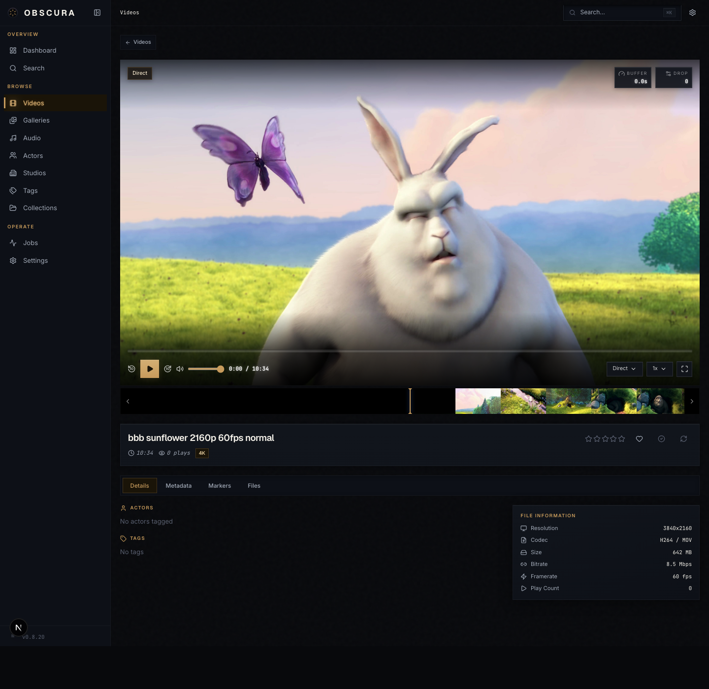
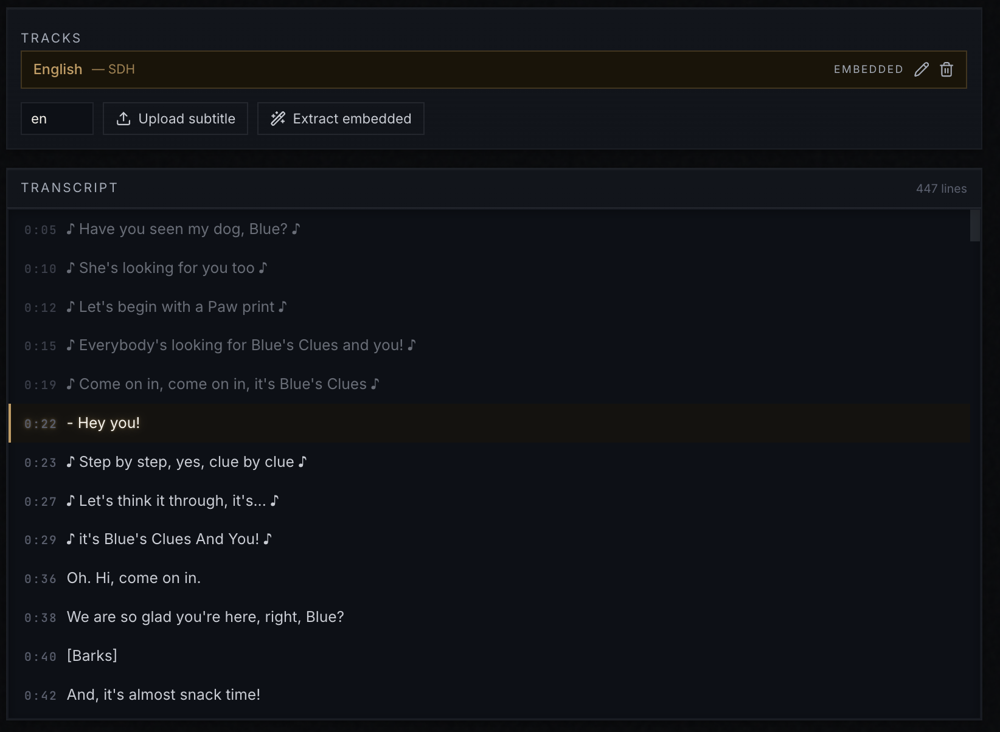
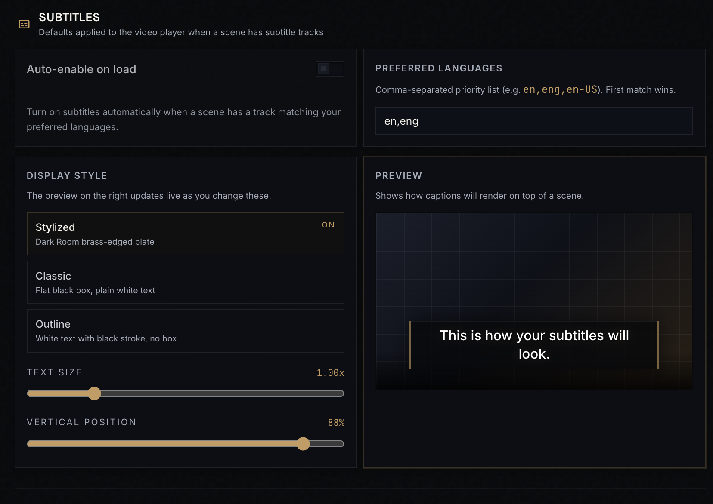
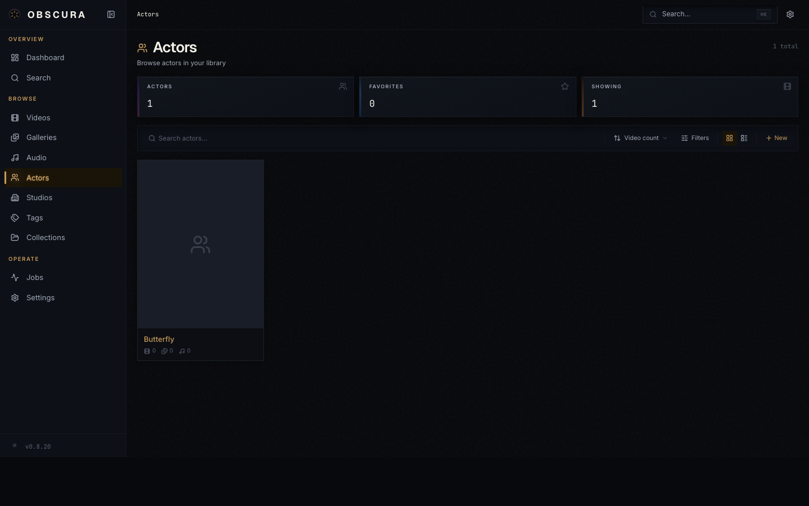
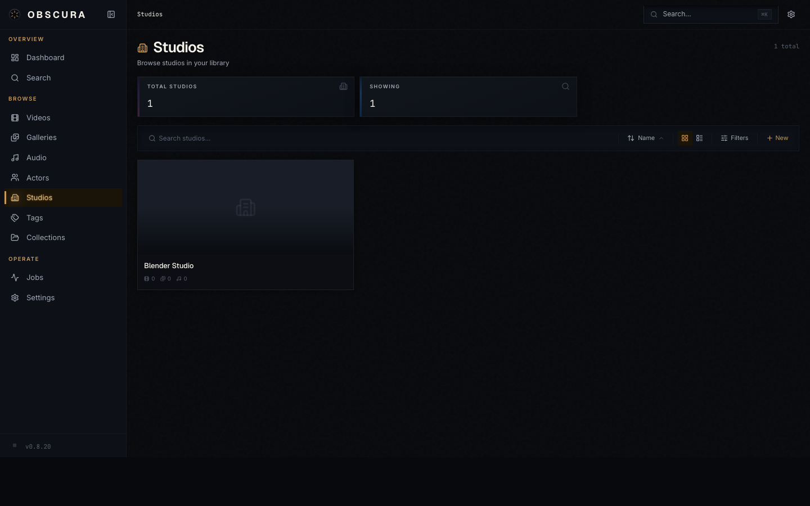
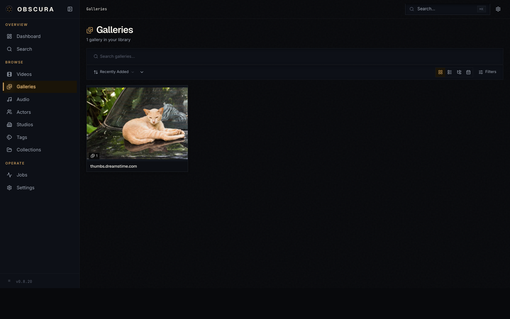

<p align="center">
  
</p>

<h1 align="center">Prismedia</h1>

<p align="center">
  <strong>A modern, self-hosted private media library.</strong>
  <br />
  Video-first, with first-class comics, images, galleries, and audio. Designed for a single trusted user on a private LAN.
</p>

<p align="center">
  <a href="https://pauljoda.github.io/Prismedia/">
    
  </a>
  <a href="https://pauljoda.github.io/Prismedia/docs/users/quick-start">
    
  </a>
  <a href="https://pauljoda.github.io/Prismedia/docs/plugins/overview">
    
  </a>
</p>

<p align="center">
  <a href="https://pauljoda.github.io/Prismedia/">Docs</a> &middot;
  <a href="#quick-start">Quick Start</a> &middot;
  <a href="#highlights">Highlights</a> &middot;
  <a href="#features">Features</a> &middot;
  <a href="https://www.reddit.com/r/PrismediaMediaApp/">Subreddit</a> &middot;
  <a href="#configuration">Configuration</a> &middot;
  <a href="#development">Development</a>
</p>

<p align="center">
  
</p>

---

## What is Prismedia?

Prismedia is a **private, self-hosted home for your entire media collection.** Videos, movies, TV series, comics, manga, books, image galleries, and audio all live together in one refined interface — organized, searchable, and ready to play from any device on your local network.

It runs as a single Docker container: PostgreSQL, ffmpeg, and the web server are all bundled together. Mount your media directories, open a browser, and you're watching. No external databases, no cloud accounts, no data leaves your network.

Discussions and community updates live on the [Prismedia subreddit](https://www.reddit.com/r/PrismediaMediaApp/).

---

## Highlights

- **Every media type, first-class** — videos, movies, TV series, comics, manga, books, image galleries, and audio libraries are all treated equally. No second-class formats.
- **Mobile first** — built for phones from day one. The desktop view is an expansion of the mobile layout, not the other way around.
- **Rich video playback** — HLS adaptive streaming with on-demand ffmpeg transcoding, a scrollable frame strip, and one-click marker + thumbnail creation from any frame.
- **Subtitles & live transcripts** — multi-language sidecar / embedded / uploaded tracks, three caption styles, and a dockable transcript panel that reads alongside the video on desktop.
- **Comic and book reader** — cbz/zip archives and image folders scan as series, keep natural page order, import ComicInfo metadata, track reading progress, and open in paged spreads or vertical webtoon mode.
- **Audio libraries** — organize and play your music and audio collection with the same metadata pipeline: albums, tracks, cover art, waveforms, performers, and shuffle support.
- **Plugin-powered metadata** — TypeScript, Python, and Stash-compatible scraper plugins expose providers for videos, series, performers, galleries, and audio. StashDB is supported natively.
- **Bulk identify** — select a batch of unmatched items and Prismedia iterates every installed provider. No more identifying things one at a time.
- **Everything cross-referenced** — videos, comics, audio, performers, studios, and tags all link to each other through the same rich metadata surface.
- **Automated scanning** — point it at a folder, walk away. Prismedia scans on a schedule and notices new files.
- **Command palette + global search** — `⌘K` from anywhere, or a dedicated search page spanning all library types.
- **Content filtering** — mark library roots as restricted to keep sensitive content out of shared views; switch with a keyboard shortcut or a gesture on mobile.
- **Drag-and-drop uploads** — add files from the browser, remove from the library, or delete from disk entirely.
- **One image, one port** — everything runs in a single Docker container. No external Postgres, no Redis URLs, no env wrangling.

---

## Quick Start

Prismedia ships as a **single Docker image** with PostgreSQL, ffmpeg, the .NET API, the Svelte frontend, and the background worker bundled. No external databases. No configuration required.

### Docker Run

```bash
docker run -d \
  --name prismedia \
  -p 8008:8008 \
  -v prismedia-data:/data \
  -v /path/to/your/media:/media \
  ghcr.io/pauljoda/prismedia:latest
```

### Docker Compose

```yaml
services:
  prismedia:
    image: ghcr.io/pauljoda/prismedia:latest
    ports:
      - "8008:8008"
    volumes:
      - prismedia-data:/data
      - /path/to/your/media:/media
    restart: unless-stopped

volumes:
  prismedia-data:
```

```bash
docker compose up -d
```

Open **http://localhost:8008** and you're done.

### Volumes

| Mount | Purpose |
|-------|---------|
| `/data` | Database, cache, thumbnails, trickplay sprites, HLS transcodes |
| `/media` | Your media library. Mount one or more directories here |

You can map as many subdirectories under `/media` as you like and register each one as a library root in Settings.

### Image tags

Prismedia publishes channel images to `ghcr.io/pauljoda/prismedia`:

| Tag | What it is | When to use |
|-----|------------|-------------|
| `latest` | The current release channel image | Default for end users. Stable, manually promoted |
| `release` / `release-X.Y.Z` | The current release image and its build-version alias | Pin to a released build version |
| `beta` / `beta-X.Y.Z` | Manual beta channel images | Preview candidate builds before release |
| `alpha` / `alpha-X.Y.Z` | Manual alpha channel images | Early testing |
| `dev` | Every commit on `main` after CI passes | Bleeding edge. Expect churn. Good for testing fixes before a release |
| `sha-abc1234` | A specific commit SHA on `main` | Pin to an exact dev build for rollback or bisection |
| `X.Y.Z-abc1234` | A specific commit for the current build version | Same as `sha-…` but self-describing |

If you're running Prismedia as your media library and want things to Just Work, use `:latest`. If you want to try a change that hasn't shipped yet, use `:dev`. See [CHANGELOG.md](CHANGELOG.md) for curated release notes.

---

## Features

### Library Dashboard

An at-a-glance overview of your collection: totals, recent activity, queue state, and live job status.

<p align="center">
  
</p>

### Videos

A responsive grid of scene cards with thumbnails, duration, resolution badges, and quick metadata. Filter, sort, and view as cards or a compact list.

<p align="center">
  
</p>

### Folder Browse & Detail

The video library supports two browsing modes. **Grid/List** shows every scene in your library as a flat feed you can sort, filter, and search. **Folders** mirrors the directory structure on disk, letting you navigate into subfolders, see scene counts per folder, and drill down to scenes inside a specific directory.

<p align="center">
  
</p>

Clicking into a folder opens a detail view inspired by media servers like Jellyfin. Each folder can carry its own metadata: a poster and backdrop image, description, studio, date, star rating, linked performers (shown as a scrollable Cast & Crew strip), and tags. The edit panel uses the same chip pickers and autocomplete as scene editing, so adding performers, tags, and studios is fast. Uploading or dragging files while viewing a folder places them directly into that folder's directory on disk — no library root picker needed.

Folders are also searchable from the command palette and the full search page, and appear on studio and tag detail pages when associated.

### Rich Video Playback

Direct playback of common formats plus on-demand HLS transcoding for anything the browser won't play natively. The scrollable frame strip under the player lets you scrub by thumbnail — and turn any frame into a marker or a custom preview image with a single click.

<p align="center">
  
</p>

### Subtitles & Live Transcripts

Prismedia treats subtitles as a first-class feature. Three ingestion paths are wired up end-to-end:

- **Sidecar discovery** — drop a `.srt` / `.vtt` / `.ass` next to a video (optionally tagged with a language, e.g. `movie.en.srt`) and it gets picked up on the next library scan.
- **Embedded extraction** — a background worker job runs `ffmpeg` against videos with soft-subtitle streams and converts each track to WebVTT automatically. Image-based subtitle codecs (PGS, VobSub) are skipped gracefully.
- **Manual upload** — drop a file in from the scene page with an inline language picker.

All tracks land in a shared **Transcript** tab where you can rename them inline, delete them, or trigger a re-extract. The transcript itself shows the full cue list with the current line highlighted, past lines grayed but still clickable, and a single click on any cue seeks the player.

<p align="center">
  
</p>

On desktop, a **Dock next to video** button pins the transcript directly beside the player with a draggable resize handle between them — watch and read at the same time, no context switching. The dock preference and last-used width persist in `localStorage`, follow you across scenes, and auto-collapse on scenes without subtitles so you never see empty space.

<p align="center">
  
</p>

The player renders captions through a custom overlay with three visual styles you can switch between on the fly:

- **Stylized** — Dark Room brass-edged plate with a subtle glow, matches the rest of the UI.
- **Classic** — flat translucent-black box with plain white text, the look of most media players.
- **Outline** — white text with a black stroke and no box, maximum transparency over the picture.

Text size and vertical position are continuously adjustable, and an in-player settings side panel lets you tweak everything live on top of whatever is currently playing. Per-user overrides persist locally; a reset button snaps you back to the library defaults.

<p align="center">
  
</p>

Library-wide defaults — auto-enable on load, preferred-language priority list (first match wins, with ISO 639-1 ↔ 639-2 equivalence so `en` also matches `eng`), default caption style, text size, and position — are all configurable from the global settings page, with a live dummy-frame preview that updates as you tweak the controls.

<p align="center">
  
</p>

### Rich Metadata, Everywhere

Every entity — videos, comics, books, audio, performers, studios — carries the same metadata surface: title, studio, performers, tags, ratings, custom notes, and provenance. Plugin-powered providers cover everything, with Stash-compatible scrapers and StashBox endpoints available through the compatibility layer.

<p align="center">
  
  
</p>

### Bulk Scraping

Select a batch of unmatched scenes, galleries, or performers and Prismedia will iterate every installed scraper to find a match. No more identifying things one at a time.

<p align="center">
  
</p>

### Community Scrapers & Plugins

Browse, install, enable, and disable community scraper plugins directly from the UI. Stash-compatible scrapers and StashDB endpoints are supported alongside native TypeScript and Python plugins — the full public scraper index is built in, no manual file copying required.

<p align="center">
  
</p>

### Galleries & Comics

Folder-based and archive-based galleries are first-class. Browse, tag, rate, link authors/performers and studios, and view them in grid or lightbox modes.

Comics and manga are part of the same gallery system — not a separate silo. Drop in cbz/zip archives or image folders, and Prismedia keeps page filenames in natural reading order, imports ComicInfo metadata where available, groups chapter archives into series-style galleries, tracks read/unread progress, and opens them in a dedicated reader with paged spreads or vertical webtoon mode.

<p align="center">
  
</p>

### Books

The book reader brings the same organized, metadata-rich experience to your reading collection. Books live alongside comics, galleries, and videos in one unified library — browsable, searchable, and readable from any device on your network.

### Audio Libraries

Organize and play your audio collection with the same metadata pipeline — libraries, tracks, cover art, tags, and performer/studio linking. Includes a built-in player with shuffle and playlist support.

<p align="center">
  
  
</p>

### Global Search + Command Palette

Press `⌘K` (or `Ctrl+K`) from anywhere to jump to anything. There's also a dedicated search page that spans scenes, performers, studios, galleries, tags, and audio libraries.

<p align="center">
  
</p>

### Library Scanning + Settings

Register multiple library roots, choose whether generated assets (trickplays, sprites, previews, HLS cache) live next to your media files or in a dedicated cache volume, and enable automatic periodic scanning so new files show up on their own.

<p align="center">
  
</p>

### Job Control

A live view of every queue and job — library scan, probe, fingerprint, thumbnail, sprite, HLS, import, scrape. Retry, cancel, and watch progress in real time.

<p align="center">
  
</p>

### Content Filtering

Mark any library root as restricted to keep specific content out of shared or public views. Flip the filter globally with a keyboard shortcut on desktop or a hidden gesture on mobile. The flag propagates to all videos, images, galleries, audio libraries, and tracks under that root.

### First-Class Mobile

Every view is designed for a phone first. Navigation, playback, scanning, scraping — everything works on mobile, not just "sort of."

<p align="center">
  
  
  
  
</p>

### Uploads & Removal

Drag files directly into the browser, or use the upload picker. Remove items from the library, or remove them from disk entirely — your choice, per action.

---

## Configuration

Prismedia works out of the box with zero configuration. These environment variables are available for advanced use:

| Variable | Default | Description |
|----------|---------|-------------|
| `PRISMEDIA_CACHE_DIR` | `/data/cache` | Directory for HLS cache, thumbnails, sprites, previews |
| `PRISMEDIA_HLS_TRANSCODER` | `Software` | Adaptive HLS encoder profile. Supported values: `Software`, `Auto`, `VideoToolbox`, `Vaapi`, `Nvenc`, `Qsv`. Hardware profiles fall back to software if ffmpeg fails. |
| `PRISMEDIA_FFMPEG_PATH` | `ffmpeg` | ffmpeg executable used for adaptive HLS generation |
| `PRISMEDIA_VAAPI_DEVICE` | `/dev/dri/renderD128` | Linux render device used when `PRISMEDIA_HLS_TRANSCODER=Vaapi` |
| `PRISMEDIA_MAX_VIDEO_UPLOAD` | `21474836480` | Max bytes for a single upload (default ~21 GiB) |
| `PRISMEDIA_SECRET` | auto-generated at `/data/.prismedia-secret` | Secret key used to encrypt plugin credentials (e.g. TMDB API keys) at rest. Auto-generated on first boot and persisted in the data volume. Override only if you want to manage it externally; changing it invalidates all previously saved plugin credentials. |

### Multiple Media Directories

Mount as many media directories as you need:

```bash
docker run -d \
  --name prismedia \
  -p 8008:8008 \
  -v prismedia-data:/data \
  -v /mnt/nas/videos:/media/videos \
  -v /mnt/nas/photos:/media/photos \
  -v /mnt/nas/music:/media/music \
  ghcr.io/pauljoda/prismedia:latest
```

Then add each one as a library root in **Settings → Library**. Per-root, you can choose whether generated assets live alongside the media files or in Prismedia's dedicated cache directory.

---

## Design Language

Prismedia uses a **Dark Control Room** visual system inspired by Blackmagic DaVinci Resolve, high-end audio rack gear, and film color-grading suites.

- **Surface hierarchy** — Five levels from near-black graphite to elevated panel gray
- **Accent** — Burnished brass (`#c49a5a`), used sparingly for active and selected states, always with glow
- **Typography** — Geist (headings), Inter (body), JetBrains Mono (metadata and utility)
- **Motion** — Weighted and deliberate, precision machinery, no bounce
- **Shape** — Sharp corners everywhere (`border-radius: 0`)

Full specification in [`docs/design-language.md`](docs/design-language.md).

---

## What's Inside

The single image bundles:

| Component | Role |
|-----------|------|
| **.NET API** | HTTP API ingress, static frontend host, streaming, and persistence |
| **Svelte** | Static web frontend |
| **.NET Worker** | Background media jobs |
| **PostgreSQL 16** | Database |
| **ffmpeg** | Video and audio transcoding |

All services run inside the container, coordinated by a single entrypoint. Port **8008** is the only exposed port.

---

## Development

### Prerequisites

- Node.js 22+
- pnpm 10+
- Docker and Docker Compose (for PostgreSQL)

### Setup

```bash
git clone https://github.com/pauljoda/prismedia.git
cd prismedia

pnpm install

# Start PostgreSQL (pg-boss manages the queue inside the DB)
docker compose -f infra/docker/docker-compose.yml up postgres -d

# Start all services in dev mode
pnpm dev
```

The app and API both run at `http://localhost:8008`, with JSON served under `/api/*`.

### Commands

| Command | Description |
|---------|-------------|
| `pnpm dev` | Start all services in development |
| `pnpm build` | Build all apps and packages |
| `pnpm check` | Lint and typecheck across the monorepo |
| `pnpm release:check` | Validate version and changelog alignment |

### Building the Docker Image Locally

```bash
docker build -f infra/docker/unified.Dockerfile -t prismedia .

docker run -p 8008:8008 -v prismedia-data:/data -v /your/media:/media prismedia
```

### Releases

Prismedia follows [Semantic Versioning](https://semver.org/) and [Keep a Changelog](https://keepachangelog.com/).

- Every commit to `main` rebuilds the `:dev` image and pushes rollback-friendly tags: `sha-<short-sha>` and `<version>-<short-sha>`.
- Manual channel publishing is handled by the **Publish Channel Image** workflow. Pick `alpha`, `beta`, or `release` from the Actions tab.
- The manual workflow does not edit package versions, rewrite changelog headings, create tags, or commit release artifacts. The build version is changed when new work begins, then channel images publish whatever version is already in `package.json`.
- The `release` channel also publishes `latest`.
- Users consuming `:latest` get the most recently promoted release image. Users who want to test unreleased changes can pin `:dev`, `:alpha`, `:beta`, or a specific `:sha-…` tag.

See the full repository policy in [CLAUDE.md](CLAUDE.md#release-channels).

---

## License

Licensed under [CC BY-NC-SA 4.0](https://creativecommons.org/licenses/by-nc-sa/4.0/).

You are free to share and adapt this work for non-commercial purposes, with attribution, under the same license terms. See [LICENSE](LICENSE) for details.
