<p align="center">
  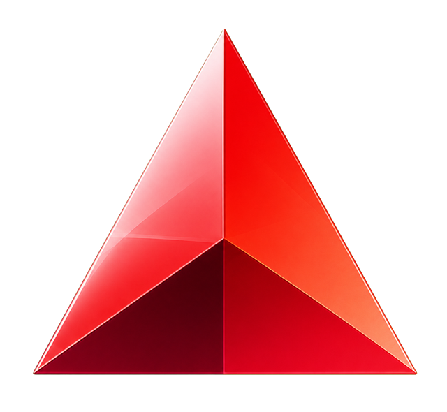
</p>

<h1 align="center">Prismedia</h1>

<p align="center">
  <strong>A private, self-hosted media library for the whole household.</strong>
  <br />
  Video-first, with first-class movies, series, images, galleries, comics, eBooks, audio, people, studios, tags, collections, plugins, and file management.
</p>

<p align="center">
  <a href="https://pauljoda.github.io/Prismedia/">
    
  </a>
  <a href="https://pauljoda.github.io/Prismedia/docs/getting-started/install">
    
  </a>
  <a href="https://github.com/pauljoda/Prismedia/pkgs/container/prismedia">
    
  </a>
</p>

<p align="center">
  <a href="https://pauljoda.github.io/Prismedia/">Docs</a> &middot;
  <a href="#quick-start">Quick Start</a> &middot;
  <a href="#what-prismedia-manages">Features</a> &middot;
  <a href="#development">Development</a> &middot;
  <a href="https://www.reddit.com/r/Prismedia/">Subreddit</a>
</p>

<p align="center">
  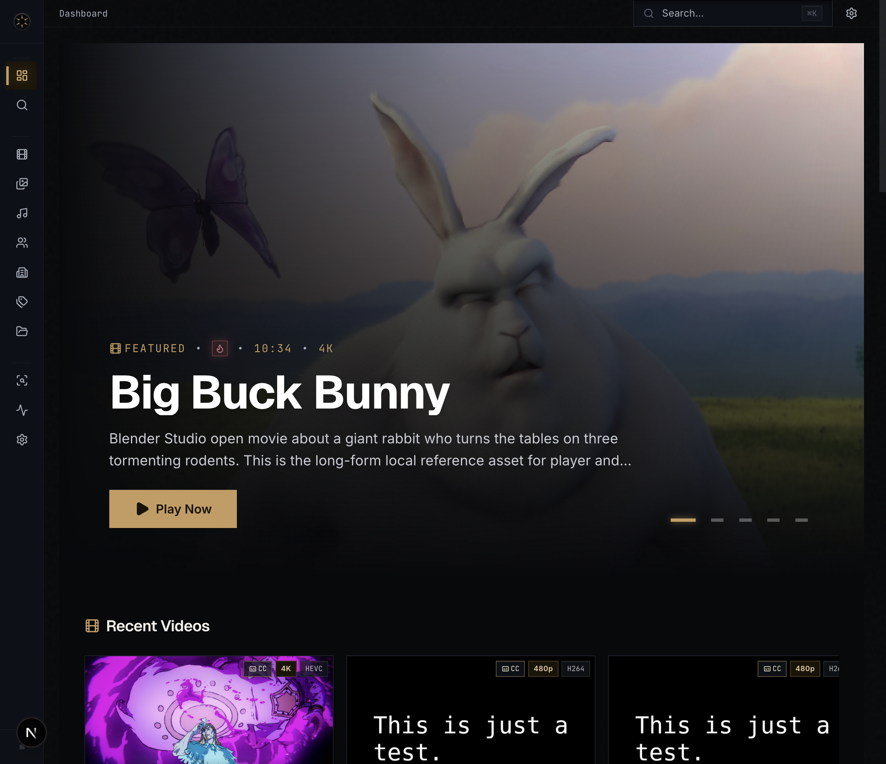
</p>

## What Is Prismedia?

Prismedia is a private media library for self-hosted collections. It is optimized for a single trusted user or household on a private LAN: mount your media, open a browser, and browse from your phone, tablet, desktop, or TV browser. It can also serve your library to **Jellyfin client apps** like Infuse and Manet.

The production image is intentionally simple. PostgreSQL 16, ffmpeg, the .NET API, the .NET worker, and the built Svelte frontend all ship together as one Docker image. Application data lives in `/data`; your library lives under `/media`; the web app listens on port `8008`.

Prismedia owns its own library model. Stash community scrapers can be wrapped as identify providers for discovery workflows, but Prismedia's schema, UI, and release process are built around its own media entities.

## Quick Start

> [!IMPORTANT]
> **Prismedia is in early development.** Not every image tag is guaranteed to be published yet. The **`dev`** tag is always built (every push to `main`), and **`alpha`** is generally available. **`beta`**, **`release`**, and **`latest`** are promoted manually and **may not be available yet** — if `latest` can't be pulled, use `dev` (or `alpha`) for now. Expect rough edges and breaking changes while things stabilize.

### Docker Run

```bash
docker run -d \
  --name prismedia \
  -p 8008:8008 \
  -v prismedia-data:/data \
  -v /path/to/your/media:/media \
  ghcr.io/pauljoda/prismedia:latest
```

Open [http://localhost:8008](http://localhost:8008), add `/media` or one of its subfolders as a watched library, then run a scan from **Jobs** or **Settings**.

### Docker Compose

```yaml
services:
  prismedia:
    image: ghcr.io/pauljoda/prismedia:latest
    ports:
      - "8008:8008"
    volumes:
      - prismedia-data:/data
      - /path/to/your/media:/media
    restart: unless-stopped

volumes:
  prismedia-data:
```

```bash
docker compose up -d
```

### Volumes

| Mount | Purpose |
| --- | --- |
| `/data` | PostgreSQL data, generated cache, thumbnails, waveforms, trickplay, HLS output, plugin state, encryption secret |
| `/media` | Your mounted media folders |

Mount `/media` read-only if Prismedia should only scan and play files. Mount it read-write if you want browser uploads, renames, moves, deletes, and file-manager organization.

### Access

The web app is open on your LAN and authenticates itself automatically (a same-origin HttpOnly cookie). The **`/api/*` and Jellyfin routes require an API key**, generated on first boot and shown in **Settings → API Access** — you'll need it for external API calls and for signing in from Jellyfin clients. See [Authentication & API Keys](https://pauljoda.github.io/Prismedia/docs/deployment/authentication).

### Image Tags

| Tag | Use |
| --- | --- |
| `latest` | Current promoted release. Recommended for normal installs. |
| `release` / `release-X.Y.Z` | Release channel and version-pinned release images. |
| `beta` / `beta-X.Y.Z` | Manual beta channel for release candidates. |
| `alpha` / `alpha-X.Y.Z` | Manual alpha channel for early testing. |
| `dev` | Latest `main` build. Useful for testing fixes before release. |
| `sha-<short-sha>` / `X.Y.Z-<short-sha>` | Exact dev build for rollback or bisection. |

Read [CHANGELOG.md](CHANGELOG.md) before upgrading a library you care about.

## What Prismedia Manages

### Library And Search

Prismedia has dedicated browse surfaces for movies, series, videos, images, galleries, comics, eBooks, audio, artists, people, studios, tags, and collections. The dashboard leads with Continue Watching and Recently Watched; the search page and command palette jump across every entity type.

<p align="center">
  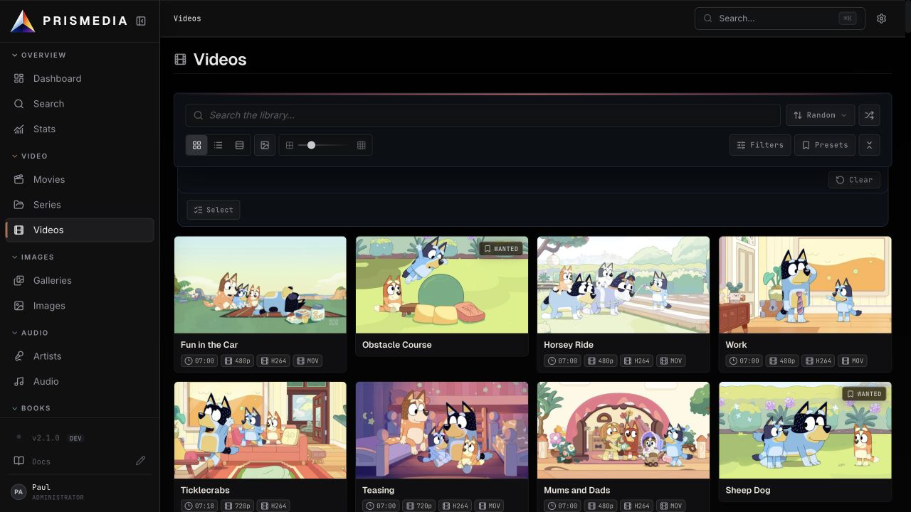
  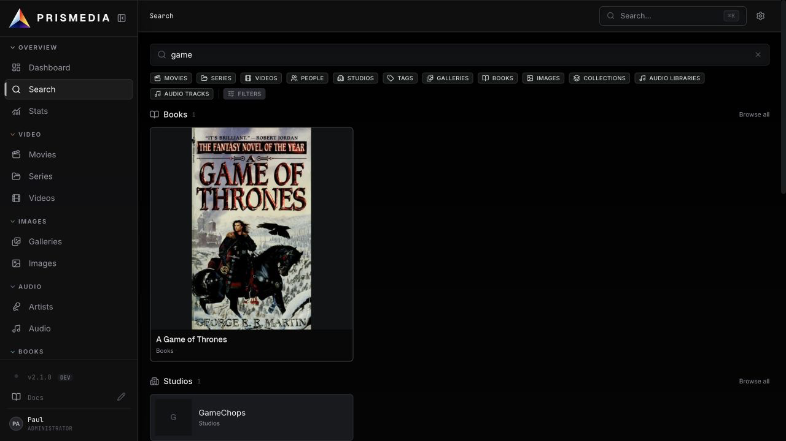
</p>

### File Manager

The **Files** workspace mirrors watched library roots and gives you practical file operations without leaving the app: open linked entities, create folders, upload, rename, move, rescan, exclude paths from scans, remove exclusions, and delete when the media mount is writable.

<p align="center">
  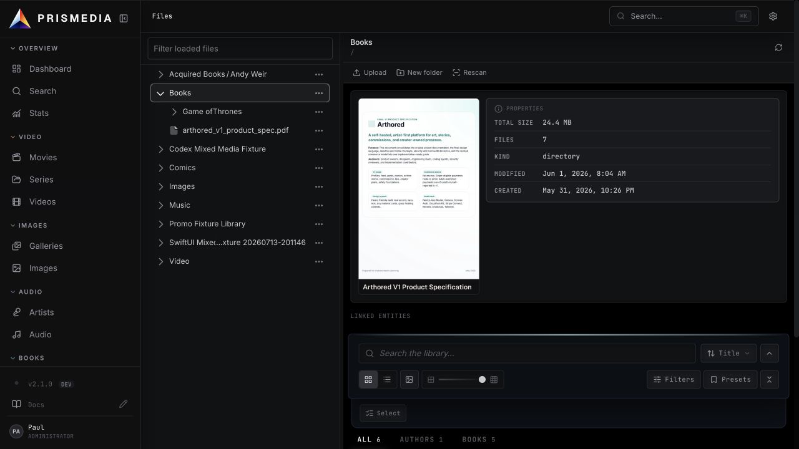
</p>

### Playback And Reading

Videos direct-play when the client can decode them, stream-copy (remux) where possible, and fall back to on-demand HLS only when a transcode is truly needed. Detail pages include subtitles, transcript management, trickplay previews, resume, metadata editing, and artwork controls.

Comics (`.cbz`/`.zip`), EPUBs, and PDFs open in a built-in reader — paged and webtoon comics, reflowable EPUBs, and a full PDF reader with selectable text, zoom, search, outline, and resume. Images and galleries use a lightbox with metadata and linked entities. Audio plays through a persistent bar with a queue, shuffle, waveforms, and OS media-control integration.

<p align="center">
  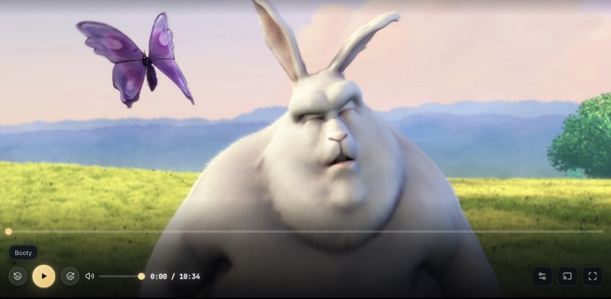
  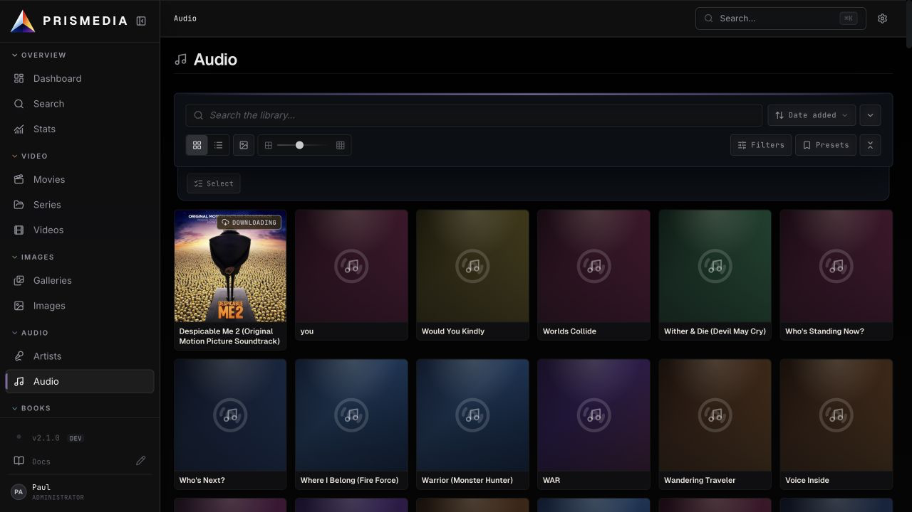
</p>

### Metadata And Identify

The Identify workspace keeps a durable review queue. Add movies, series, videos, books, galleries, images, people, studios, or audio, run providers, review field-by-field proposals, choose artwork, walk into streaming child proposals (seasons/episodes, volumes/chapters, albums/tracks), and accept when the result is right. **Auto Identify** can apply confident matches automatically during scans.

Plugins can be native TypeScript or Python, and Stash community scrapers can be wrapped as providers.

<p align="center">
  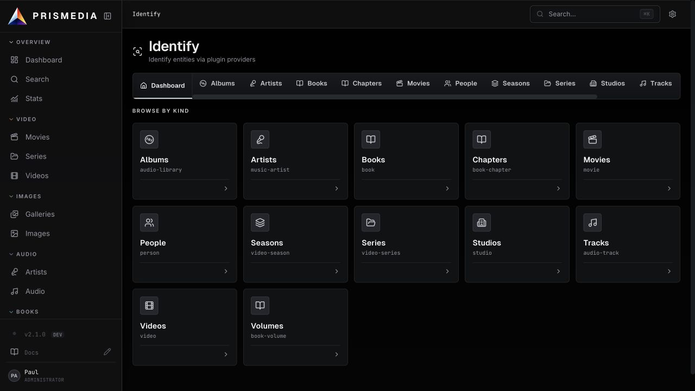
  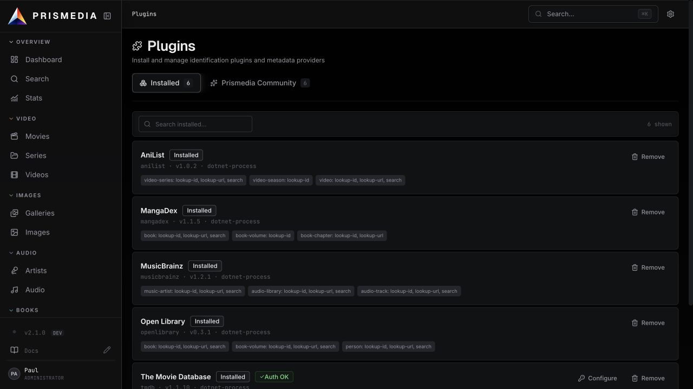
</p>

### Requests

Request is Prismedia's first-party acquisition workspace. Search for books, authors, movies, series, artists, and albums, then let Prismedia create Wanted library entities, search Prowlarr or direct Torznab/Newznab indexers, route releases to qBittorrent, Transmission, or SABnzbd, monitor the download, import the result into the right library, and keep durable History for every grab, import, failure, blocklist, and removal. Wanted and acquired items live on the same library pages with release picking, live progress, monitoring, Missing/Cutoff Unmet lists, and detail metadata from providers such as OpenLibrary, TMDB, and MusicBrainz.

<p align="center">
  
  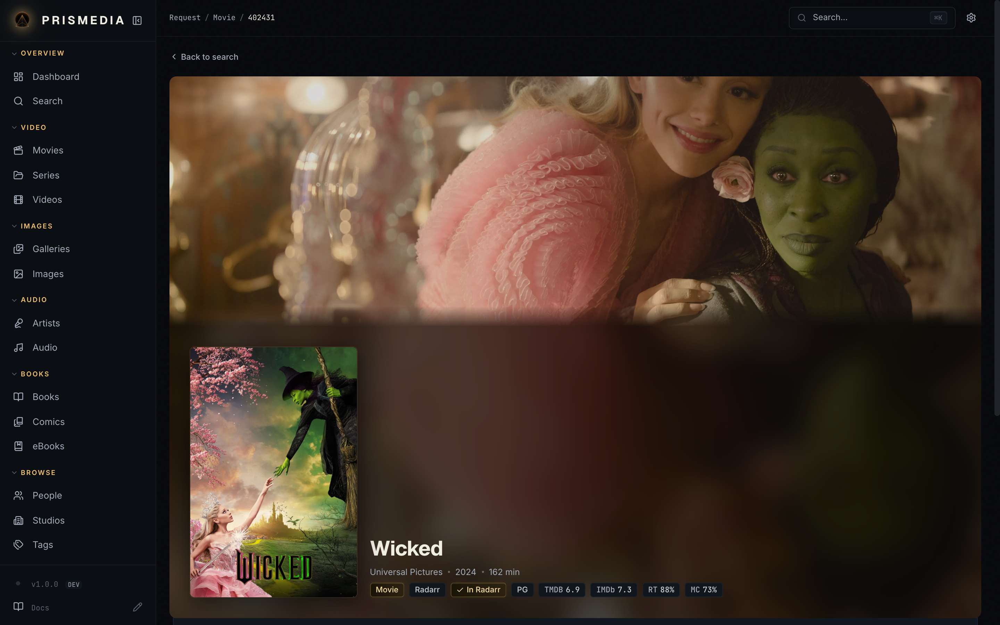
</p>

### Jellyfin Clients (Experimental)

A Jellyfin-compatible API lets client apps discover Prismedia, sign in, and stream — tested with **Infuse** (video + audio) and music clients like **Manet**, **Finamp**, and **Symfonium**. Create lightweight "fake user" profiles, sign in with the app API key, and give each profile its own NSFW visibility so you can run separate SFW and NSFW "servers" in your client. Resume position and play counts sync both ways. See [Jellyfin Compatibility](https://pauljoda.github.io/Prismedia/docs/jellyfin/overview).

### Navigation And Mobile

The sidebar is yours to arrange — rename, reorder, group, hide, and collapse sections — and your layout is saved on the server and follows you across devices. On phones, a roomy bottom bar holds up to four pinned destinations, and a navigation drawer opens by swiping up from the bar. Every view is touch-first and avoids hover-only core actions.

<p align="center">
  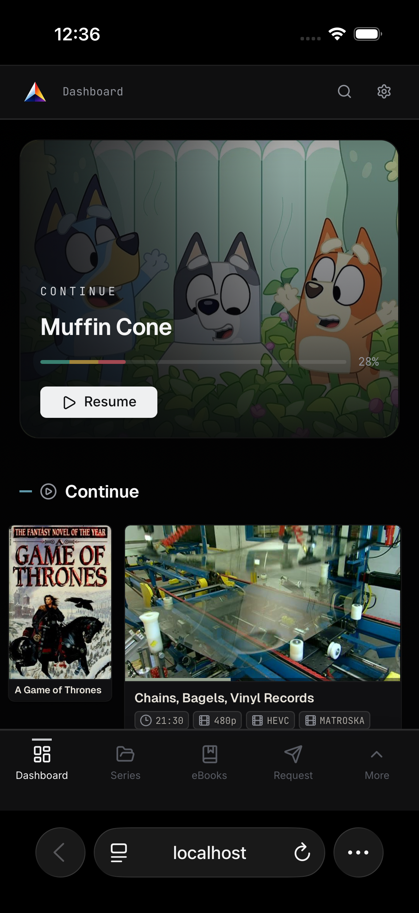
  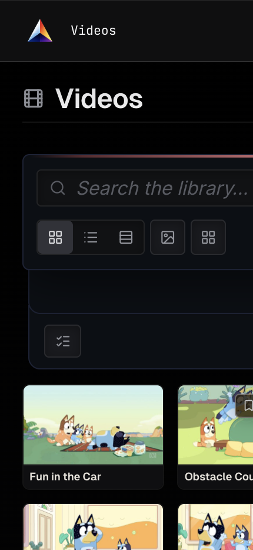
  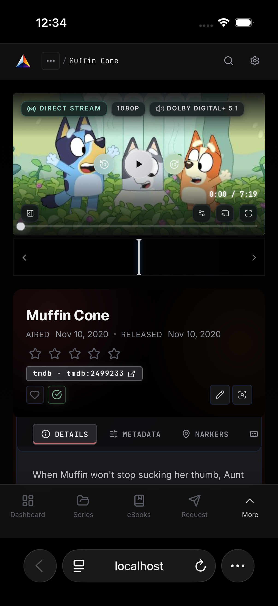
  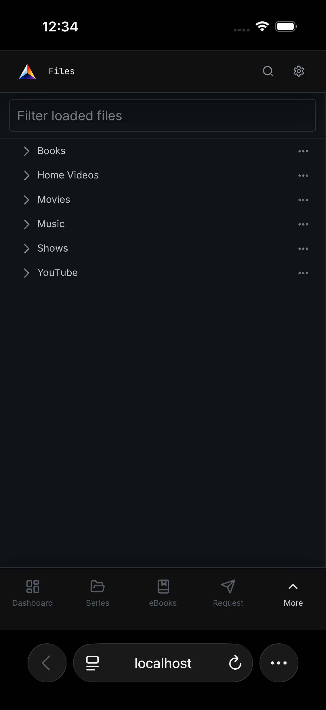
</p>

### Collections

Collections are simple groupings for browsing and curation. They can be manual, rule-driven, or hybrid, and they can contain movies, series, galleries, images, books, and audio tracks. They are not a global playback queue; they are an organizational view over your library.

<p align="center">
  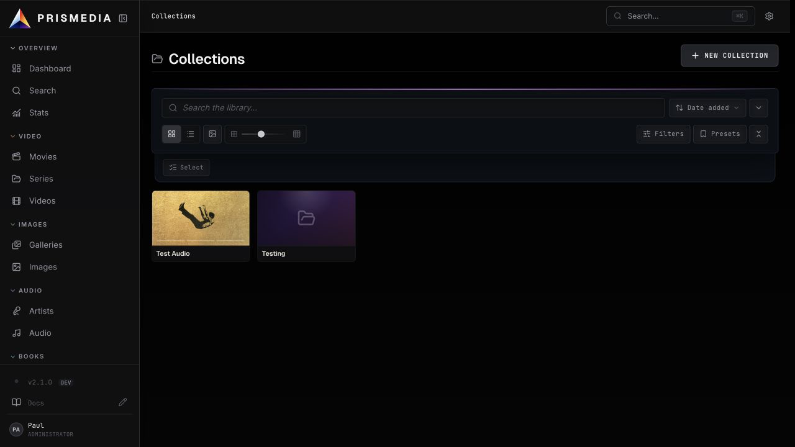
</p>

### Jobs, Settings, And Visibility

Long-running work runs in the .NET worker and is visible in **Jobs**: scans, probes, previews, thumbnails, sprites, waveforms, HLS, subtitles, identify, imports, collection refreshes, and maintenance. Settings control watched libraries, NSFW visibility, playback, subtitles, generated storage, worker concurrency, API access, and diagnostics.

<p align="center">
  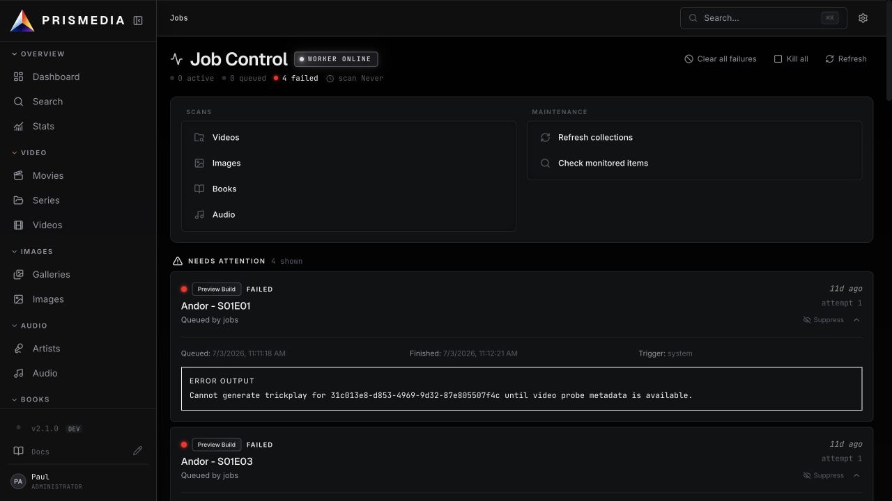
  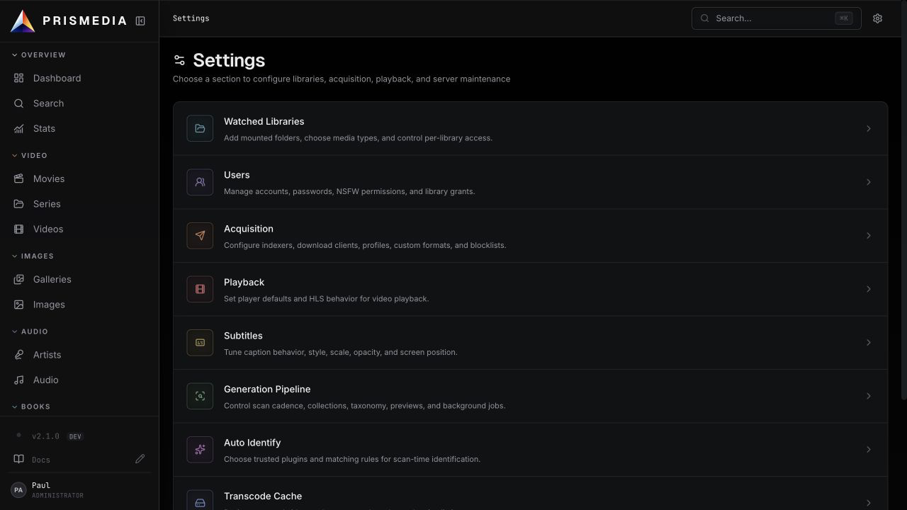
</p>

## Design Language

Prismedia follows **Prism Noir Luxe**: dark material surfaces, glass only for floating or interactive layers, controlled radii, brass glow for active state, Cinzel/Geist/Inter/JetBrains Mono type voices, and dense layouts that stay usable on touch screens.

The design language lives in [docs/design-language.md](docs/design-language.md) and is mirrored in the [documentation site](https://pauljoda.github.io/Prismedia/docs/developers/design-language).

## Documentation

- [Install & Run](https://pauljoda.github.io/Prismedia/docs/getting-started/install)
- [Your First Library & Scan](https://pauljoda.github.io/Prismedia/docs/getting-started/first-library)
- [Identify & Enrich Your Media](https://pauljoda.github.io/Prismedia/docs/getting-started/identify-walkthrough)
- [Library & Scanning](https://pauljoda.github.io/Prismedia/docs/library/overview)
- [Requests (Radarr / Sonarr / Lidarr)](https://pauljoda.github.io/Prismedia/docs/using/requests)
- [Jellyfin Compatibility](https://pauljoda.github.io/Prismedia/docs/jellyfin/overview)
- [Reverse Proxy & Auth Middleware](https://pauljoda.github.io/Prismedia/docs/deployment/reverse-proxy)
- [Architecture](https://pauljoda.github.io/Prismedia/docs/developers/architecture)

## Development

### Prerequisites

- Node.js 22
- pnpm 10
- .NET 10 SDK
- Docker
- ffmpeg for media work outside the unified image

### Local Stack

```bash
pnpm install
docker compose -f infra/docker/docker-compose.yml up -d postgres
pnpm --filter @prismedia/web-svelte dev
dotnet run --project apps/backend/src/Prismedia.Api/Prismedia.Api.csproj
dotnet run --project apps/backend/src/Prismedia.Worker/Prismedia.Worker.csproj
```

Vite runs at [http://localhost:5173](http://localhost:5173) and proxies API calls to the .NET API at [http://localhost:8008](http://localhost:8008).

### Useful Commands

```bash
pnpm check          # frontend lint/typecheck through turbo
pnpm test:unit      # TypeScript unit tests
pnpm test:web-svelte
pnpm test:backend   # .NET tests
pnpm docs:check     # Docusaurus typecheck + build
pnpm release:check  # changelog + workspace version validation
```

### Build The Production Image

```bash
docker build -f infra/docker/unified.Dockerfile -t prismedia:local .
```

## Release Notes

Prismedia starts at `1.0.0` and uses plain SemVer versions. The root `package.json` is the build version and all workspace package versions must match it. Channel publishing never edits package versions or changelog headings; it only publishes the already-decided build.

See [CHANGELOG.md](CHANGELOG.md) for user-facing release notes.

## License

See [LICENSE](LICENSE).
