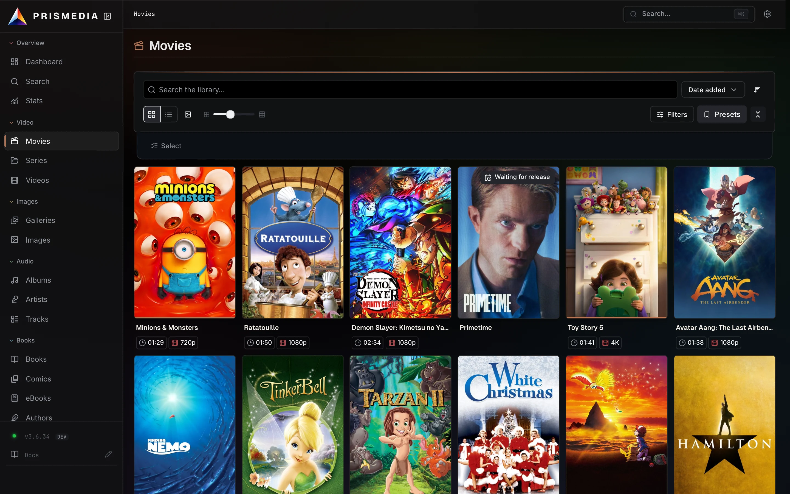

<p align="center">
  
</p>

<h1 align="center">Prismedia</h1>

<p align="center">
  <strong>A clear home for all your media.</strong><br />
  A private, self-hosted library for watching, reading, listening, and managing your collection.
</p>

<p align="center">
  <a href="https://pauljoda.github.io/Prismedia/">Website</a> &middot;
  <a href="#quick-start">Quick start</a> &middot;
  <a href="https://pauljoda.github.io/Prismedia/docs/intro">Guides</a> &middot;
  <a href="https://apps.apple.com/us/app/prismedia/id6792944211">App Store</a> &middot;
  <a href="https://www.reddit.com/r/Prismedia/">Community</a>
</p>

[](https://pauljoda.github.io/Prismedia/)

## One library, across media types

Movies, series, music, books, audiobooks, comics, images, and galleries share a common flow: find the right item, identify it, organize its files, then watch, read, or listen. Prismedia keeps that flow in one app, with an experience suited to each medium.

The shared foundation is the **Entity**: a library item that holds its identity, metadata, artwork, files, relationships, and personal progress. A requested title becomes the same item you eventually play or read. The prism represents that idea: one light enters, and the different media experiences take their own colors.

Run the server on your own computer or NAS. The web app is the complete management workspace; the native apps connect to the same server and account. Download Prismedia for iPhone, iPad, and Apple TV from the [App Store](https://apps.apple.com/us/app/prismedia/id6792944211).

## What you can do

| Task | In Prismedia |
| --- | --- |
| Organize an existing collection | Scan watched folders, browse by medium, and connect items through people, artists, authors, tags, and collections. [Folder guide](https://pauljoda.github.io/Prismedia/docs/getting-started/organize-folders). |
| Watch | Play video in the browser or native app, with resume, subtitles, and direct playback or conversion according to the client's capabilities. [Playback guide](https://pauljoda.github.io/Prismedia/docs/using/playback). |
| Read and listen | Read EPUBs, PDFs, and comics; play audiobooks; use the native reader's typography and page settings. Titles with both text and audio can use approximate chapter alignment. [Reading and listening](https://pauljoda.github.io/Prismedia/docs/using/read-and-listen). |
| Play music | Browse artists, albums, and tracks, then use the web or native player and queue. Playback sessions are separate on each device. [Music players](https://pauljoda.github.io/Prismedia/docs/using/music-player). |
| Find metadata | Use provider plugins to review matches, artwork, and relationships before applying them. [Identify walkthrough](https://pauljoda.github.io/Prismedia/docs/getting-started/identify-walkthrough). |
| Request media | Search metadata sources, use your existing indexers and download clients, and follow a request through acquisition and import. [Request setup](https://pauljoda.github.io/Prismedia/docs/using/requests). |
| Manage the library | Use the browser file manager, household accounts, background jobs, and database backups. [Start with the guides](https://pauljoda.github.io/Prismedia/docs/intro). |

Prismedia does not include media. You supply your own files or configure your sources. Requests, indexers, and download clients are optional when cataloging a collection you already have.

## Quick start

You need Docker, persistent storage for Prismedia's state, and a media folder on the machine running Docker. The single container includes the database, web app, API, background worker, and media tools.

Save this as `compose.yaml`, replacing `/path/to/your/media` with your existing media folder:

```yaml
services:
  prismedia:
    image: ghcr.io/pauljoda/prismedia:latest
    ports:
      - "8008:8008"
    volumes:
      - prismedia-data:/data
      - /path/to/your/media:/media
    restart: unless-stopped

volumes:
  prismedia-data:
```

From the same directory, run:

```bash
docker compose up -d
```

1. Open [http://localhost:8008](http://localhost:8008) on the server computer. From another device, use the server's reachable network address and port.
2. Complete the setup wizard to create your administrator account.
3. Add a watched root in **Settings → Watched Libraries**, such as `/media/movies`, and enable its matching scan type. Enter the path **inside the container**.
4. Check the scan in **Jobs**, then open an item from its library to play or read it.

See [Install & Run](https://pauljoda.github.io/Prismedia/docs/getting-started/install) for Docker run, configuration, and writable versus read-only mounts. The [first-library guide](https://pauljoda.github.io/Prismedia/docs/getting-started/first-library) walks through verifying the scan.

### Storage

| Mount | What belongs there |
| --- | --- |
| `/data` | Database, accounts, progress, settings, encryption secret, and generated artwork and playback files. Keep this volume when updating or recreating the container. |
| `/media` | Your source media folders. Use a read-only mount for scanning and playback, or allow writes for imports and file-management operations. |

Keep download staging outside watched roots. [Organize Your Media Folders](https://pauljoda.github.io/Prismedia/docs/getting-started/organize-folders) explains layouts, Docker path mapping, and importing from a separate download client.

Back up your media separately from Prismedia's state. Read [Backups & Restore](https://pauljoda.github.io/Prismedia/docs/deployment/backups) before relying on built-in database backups as a full instance backup.

### Updates

`latest` and `release` follow the promoted release channel. `beta` and `alpha` are for earlier testing; `dev` follows `main`. Use a published version-pinned tag when you want to keep a specific build.

Read [CHANGELOG.md](CHANGELOG.md) and the [upgrade guide](https://pauljoda.github.io/Prismedia/docs/deployment/upgrading) before changing versions. Preserve `/data`; a downgrade after a schema change may require restoring your pre-upgrade snapshot.

## Help and contributions

- [Search the documentation](https://pauljoda.github.io/Prismedia/search) for setup and feature guides.
- [Troubleshooting](https://pauljoda.github.io/Prismedia/docs/advanced/troubleshooting) covers connection, scanning, imports, and playback.
- Ask setup and usage questions in [r/Prismedia](https://www.reddit.com/r/Prismedia/).
- [Open an issue](https://github.com/pauljoda/Prismedia/issues/new/choose) for a bug, missing documentation, or feature suggestion. Remove private details from logs and screenshots.
- Read [Contributing](https://pauljoda.github.io/Prismedia/docs/developers/contributing) for development conventions.
- Report suspected vulnerabilities privately using the [security policy](SECURITY.md).

Metadata providers use Prismedia's .NET plugin protocol; Stash YAML scrapers run through the Stash compatibility adapter. See the [plugin guide](https://pauljoda.github.io/Prismedia/docs/plugins/overview) and [Prismedia-Plugins](https://github.com/pauljoda/Prismedia-Plugins) for the current contract and implementations.

## Development

### Nix / NixOS

The repository flake is the recommended development setup. With Nix and a
Docker daemon available, it installs the complete pinned system toolchain and
the matching Playwright browser and Jellyfin FFmpeg build:

```bash
nix develop
prismedia-setup
prismedia-doctor
```

NixOS users can import the included host module to enable Docker, `nix-ld`,
flakes, optional GPU device access, and direnv integration. See the complete
[Nix development guide](docs/nix-development.md) for fresh-host configuration,
rootless/remote Docker options, and flake maintenance.

### Manual Prerequisites

Without Nix, install:

- Node.js 22
- pnpm 10.30.3
- .NET 10 SDK
- Docker
- ffmpeg for media work outside the unified image

### Local Stack

```bash
pnpm install
docker compose -f infra/docker/docker-compose.yml up -d postgres
pnpm --filter @prismedia/web-svelte dev
dotnet run --project apps/backend/src/Prismedia.Api/Prismedia.Api.csproj
dotnet run --project apps/backend/src/Prismedia.Worker/Prismedia.Worker.csproj
```

Open the running application through the .NET host at [http://localhost:8008](http://localhost:8008). Vite provides frontend hot reload behind the development stack, but port `8008` is the canonical app surface and same-origin API entry point.

### Useful Commands

```bash
pnpm check          # frontend lint/typecheck through turbo
pnpm test:unit      # TypeScript unit tests
pnpm test:web-svelte
pnpm test:backend   # .NET tests
pnpm docs:check     # Docusaurus typecheck + build
pnpm release:check  # changelog + workspace version validation
```

### Build The Production Image

```bash
docker build -f infra/docker/unified.Dockerfile -t prismedia:local .
```

## Release Notes

Prismedia starts at `1.0.0` and uses plain SemVer versions. The root `package.json` is the build version and all workspace package versions must match it. Channel publishing never edits package versions or changelog headings; it only publishes the already-decided build.

See [CHANGELOG.md](CHANGELOG.md) for user-facing release notes.

## License

See [LICENSE](LICENSE).
