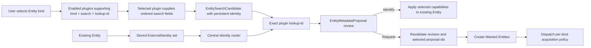

# Architecture

## Runtime Topology

Prismedia is organized as a Docker-first monorepo with two primary runtime services:

- `backend` - .NET API, HTTP ingress, EF Core persistence, static frontend host
- `backend-worker` - .NET background process for scan, fingerprint, preview, and import jobs

Supporting services:

- `postgres` - application database and durable job state. No separate queue service is required.

## Responsibility Boundaries

The backend architecture contract lives in [backend-architecture-contract.md](backend-architecture-contract.md). New backend work should follow that document: Clean Architecture, DDD-lite domain objects, CQRS-lite use cases, EF Core as the infrastructure persistence adapter, DTO-based API boundaries, and OpenAPI-generated frontend clients.

### apps/web-svelte

- user interface
- responsive layout and navigation
- asset browsing, metadata workflows, settings surfaces
- static frontend build consumed by the .NET API host

### apps/backend

- same-origin `/api` transport layer
- request validation and route composition
- EF Core persistence and migrations
- local streaming endpoints
- heavy media work
- long-running or restart-safe tasks
- queue execution, retries, and progress reporting

### packages/contracts

- frontend-only constants, media helpers, and plugin protocol types
- server contracts live in `apps/backend/src/Prismedia.Contracts`

### packages/ui-svelte

- design tokens
- shared component helpers
- visual language primitives for the Svelte app

## Domain Direction

The application schema is intentionally not a direct copy of Stash and should not become a custom global entity graph.

Core library concepts:

- videos, series, seasons, and episodes
- images and galleries
- books, volumes, chapters, and pages
- audio libraries and tracks
- people, studios, tags, and collections
- fingerprints and provider source matches
- job runs and library roots

Key rules:

- Domain entities express library behavior and invariants.
- Physical files should remain modelable independently from canonical asset identity.
- EF Core persists entity records, capability/detail rows, child links, relationship links, media files, playback state, settings, and jobs.
- Child and relationship links are persistence structures, not a global `EntityGraph` runtime.
- Imported stash data is normalized into Prismedia-owned records.
- Provider provenance must be persisted for auditability and future provider expansion.

## Entity Contract

`Entity` is the stable application shape, not a page-specific view model. Public
read contracts form one additive projection ladder:

```text
IEntityRef          id + kind + title
  └─ IEntitySummary thumbnail/list context
       └─ IEntityDocument capabilities + children + relationships
```

- References cross aggregate and relationship boundaries.
- Summaries feed shared thumbnail, grid, picker, and shelf surfaces.
- Documents feed detail pages and capability-driven actions.
- Kind-specific pages start from the Entity document and read playback,
  description, images, positions, files, acquisition, and other behavior from
  capabilities. They do not require a parallel movie/book/show API shape.
- Search candidates and metadata proposals are intentionally not Entities. A
  candidate is an upstream choice; a proposal is a potential mutation or a
  blueprint for a Wanted Entity. UI components for those contracts render them
  directly instead of fabricating Entity ids and capabilities.

The .NET contracts are the server source of truth. The generated frontend
client carries these shapes into Svelte; route-local copies and hand-maintained
wire unions are not allowed.

### Entity lifecycle truth

`ParentEntityId` is the one structural hierarchy used by source ownership,
child monitoring, managed file deletion, import materialization, and cleanup.
An Entity is **source-backed** when it or any structural descendant owns an
`EntityFileRole.Source` file. That projection is shared by detail capabilities,
thumbnails, Identify eligibility, Availability filters, and destructive-action
preflight; a route must not infer on-disk state from kind-specific detail rows.

Source ownership, Wanted state, monitoring intent, and an acquisition attempt
are deliberately independent facts:

- a stable monitor targets the Entity and may outlive many acquisition rows;
- an acquisition is transient work and may be replaced, retried, or removed;
- turning monitoring off recursively tears down transfers, queued work, and
  off-disk acquisition state, removes fileless descendants, and clears Wanted
  and monitor state from the source-backed Entity closure it retains;
- an explicitly unmonitored child records an identity suppression, so an active
  parent monitor cannot silently recreate that child;
- managed **Delete files** is exposed through one Entity capability. A directly
  monitored Entity returns to Wanted and starts a fresh acquisition; an
  unmonitored branch disappears after its managed source paths are removed.

These rules apply to every registered kind. Series/seasons, authors/books, and
artists/albums are examples of the same Entity lifecycle, not separate product
models.

## Plugin Identity and Discovery

Plugin installation identity and upstream content identity are separate:

- `PluginId` selects an installed manifest/executable.
- `ExternalIdentity(namespace, value)` identifies an upstream record.
- `PluginIdentityRoute` pairs them only for one dispatch.

Namespaces are canonical lowercase. Values are opaque, case-sensitive, and may
contain colons. Entities store external identities without assuming the plugin
id equals the namespace. The central router matches entity kind, action, and
namespace against enabled manifest-v2 support declarations.



Every candidate and independently selectable structural proposal must round-trip
through a context-free lookup by the same kind and exact identity. This is the
invariant that lets monitoring, background enrichment, and reviewed requests
run long after the original search UI is gone.

Request commits do not trust client-supplied child identities. Review returns a
deterministic proposal revision and opaque proposal ids; commit re-runs the exact
plugin without cache, compares the revision, validates selection depth, derives
each identity from the fresh proposal, and only then begins writes.

Existing-Entity monitoring actions enter through the local Entity id. The
server loads that Entity's authoritative plugin identity and selects a capable
route centrally; the frontend never chooses a plugin by convention or flattens
an identity into a delimiter-sensitive string. Parent pages compose the same
child-monitoring control over their direct Entity children (series to seasons,
authors to books, artists to albums) rather than inventing medium-specific
passes or provider-only pseudo-Entities.

## Acquisition Policy Modules

The acquisition core owns orchestration, persistence, queueing, and download
clients. Media-specific behavior lives behind `IAcquisitionPolicyModule`:

- supported Entity kinds;
- contextual query ladders;
- Torznab/Newznab category routing;
- release acceptance and ranking.

Filesystem placement is a separate trusted boundary: each acquisition kind
registers an `IAcquisitionImportEngine`, and immediate Entity/file binding is
selected through `IImportedEntityMaterializationPolicy`. Import engines reserve
an exact placement plan before touching disk and checkpoint each unit so a
worker restart resumes the same move, copy, or hardlink instead of inventing a
second target.

Book, movie, music, and TV policies and import engines register independently.
Adding a new media kind extends those registries rather than adding conditionals
to the acquisition service. Metadata plugins remain responsible for upstream
identity, search fields, provider ordering, and metadata proposals; they do not
receive arbitrary filesystem or download-client access. External identities
flow through acquisition/import as `ExternalIdentity`; the persistence columns
are `identity_namespace` and `identity_value`, not misleading plugin-id fields.

## Queue Direction

Initial queue families:

- `library-scan`
- `media-probe`
- `fingerprint`
- `preview`
- `metadata-import`

Queues must be durable, restart-safe, and visible in the UI.
