# Codebase Flow Map

This page is for a new developer who needs to understand how Prismedia moves from
screen to API to domain behavior to database and back again. It is a codebase map,
not an exhaustive component catalog.

Snapshot date: June 16, 2026.

## Read This First

Prismedia has three big rules that explain most of the repo:

1. The .NET backend owns server behavior, persistence, HTTP contracts, migrations,
   jobs, playback preparation, and integration adapters.
2. The Svelte app is a static frontend client. It calls the backend through
   generated OpenAPI clients and local presentation helpers.
3. Long-running media work is durable job work. It moves through PostgreSQL job
   rows and the .NET worker, not a TypeScript worker or browser process.

## Runtime Shape

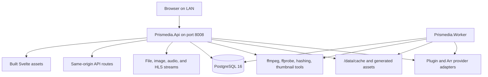

The API process also applies EF Core migrations on startup. The worker waits for
the database to be reachable and migrated before it begins claiming work.

## Code Layout At A Glance

| Area | Path | What it owns |
| --- | --- | --- |
| Web app | `apps/web-svelte` | Svelte routes, app chrome, stores, generated API client, entity grids/details, media players, readers. |
| API host | `apps/backend/src/Prismedia.Api` | Minimal API endpoint composition, auth, OpenAPI, static frontend hosting, codegen manifest, HTTP result mapping. |
| Contracts | `apps/backend/src/Prismedia.Contracts` | Public .NET request/response DTOs consumed by OpenAPI generation. |
| Application | `apps/backend/src/Prismedia.Application` | Use-case services, job handlers, ports, settings, security, playback policy, Jellyfin catalog projection. |
| Domain | `apps/backend/src/Prismedia.Domain` | Entity kinds, behavior-bearing entities, capabilities, coded enums, taxonomy concepts. |
| Infrastructure | `apps/backend/src/Prismedia.Infrastructure` | EF Core, row models, migrations, repositories/read services, media tools, plugins, requests, queue storage. |
| Worker | `apps/backend/src/Prismedia.Worker` | Hosted process that registers worker services and runs queue/scheduler hosted services. |
| Shared UI | `packages/ui-svelte` | Domain-free Svelte primitives, composed UI pieces, tokens, motion helpers. |
| Documentation site | `documentation-site` | Docusaurus docs published separately from the app shell. |

Current repository scale from `rg --files`: `apps/web-svelte` has about 889 files,
backend source has about 611 files, backend tests have about 110 files, and the
repo has about 261 test files across C# and TypeScript.

## Dependency Direction

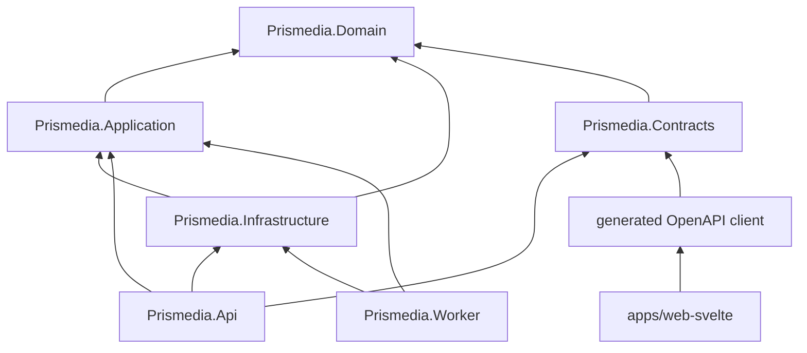

The most important practical habit: when a feature touches a user action, start
at the route or endpoint, then follow the dependency direction inward. Do not
skip directly from a Svelte component into database-shaped assumptions.

## Request To Render Flow

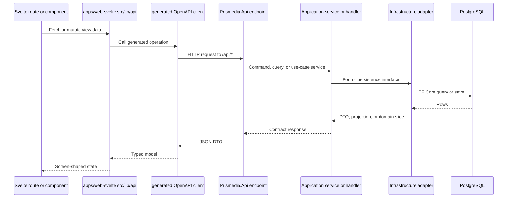

Read-only endpoints often project EF rows directly into contract DTOs. Writes
should flow through a command or use-case service, call domain behavior where
there is a business invariant, and save once per use case whenever possible.

## Frontend Flow

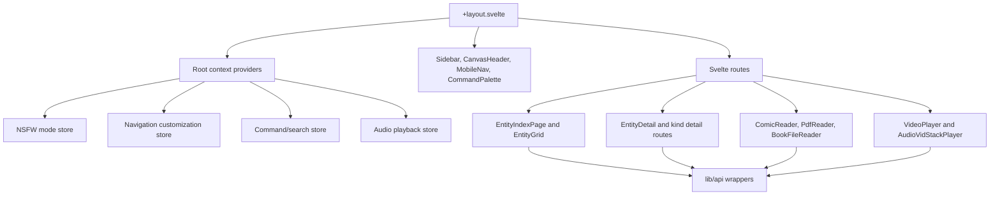

The frontend is route-driven, but the reusable entity scaffolds carry a lot of
the product surface:

- `EntityIndexPage` owns the common library page shell.
- `EntityGrid`, `EntityGridToolbar`, `EntityGridFilterDrawer`, and pagination
  modules own browsing, filtering, selection, and view modes.
- `EntityDetail` owns the shared detail surface for descriptions, metadata,
  images, relationships, children, progress, and edit actions.
- `EntityThumbnail` owns grid card rendering, artwork fallbacks, preview hover,
  badges, progress, and reference chips.
- Route pages usually choose kind-specific configuration and delegate to shared
  scaffolds instead of rebuilding layouts from scratch.

## API Surface Flow

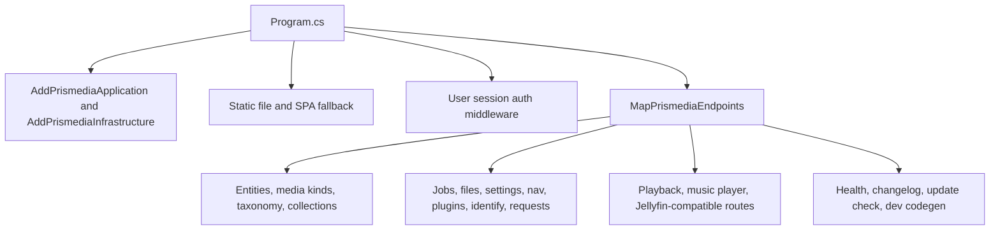

Endpoint files should stay thin. They decode HTTP-shaped input, call application
services, and return explicit contract DTOs or `ApiProblem` responses.

Important groups currently mapped:

| Group | Primary route area | Typical owner |
| --- | --- | --- |
| Entity browse/detail | `/api/entities`, kind aliases like `/api/videos` | `IEntityReadService`, entity projectors, generated DTOs. |
| Library roots | `/api/libraries` | Settings and scan-root persistence. |
| Files | `/api/files` | `FilesService`, managed storage, file persistence. |
| Jobs | `/api/jobs` | `JobService`, `IJobQueueService`, `job_runs`. |
| Identify | `/api/identify` | Plugin services, identify queues, cascade runners. |
| Requests | `/api/requests` | Radarr, Sonarr, Lidarr clients and history stores. |
| Playback | `/api/playback`, `/api/music-player`, Jellyfin routes | Playback services, HLS assets, stream sources. |
| Settings/auth | `/api/settings`, `/api/auth`, `/api/users` | Settings registry, user authentication, and user administration services. |

## Background Job Flow

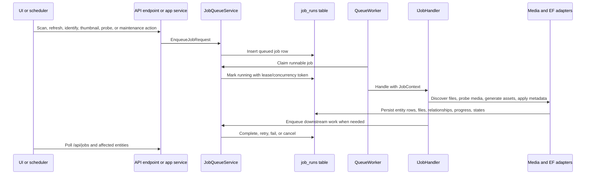

Registered handler families:

| Family | Examples | What they do |
| --- | --- | --- |
| Scanning | `ScanLibraryJobHandler`, `ScanGalleryJobHandler`, `ScanBookJobHandler`, `ScanAudioJobHandler` | Walk roots, classify folders/files, upsert entities, enqueue downstream work. |
| Probe | `ProbeVideoJobHandler`, `ProbeAudioJobHandler` | Run media probes and persist technical metadata. |
| Fingerprint | `FingerprintJobHandler` for video, image, audio | Compute MD5/oshash-style fingerprints where enabled and needed. |
| Asset generation | Grid thumbnails, image thumbnails, book covers/pages, audio waveforms, video previews, subtitles | Produce generated assets and capability state. |
| Identify | Search, bulk identify, auto identify, cascade identify | Call providers/plugins, store review state, apply metadata and structure. |
| Maintenance | Refresh entity, refresh collection, library maintenance | Keep derived views and stale records tidy. |

## Entity And Capability Flow

```mermaid
flowchart LR
  FileSystem["Watched files"] --> Scan["Scan handlers"]
  Scan --> DomainEntity["Domain Entity and kind-specific types"]
  DomainEntity --> Capabilities["Domain capabilities"]
  Capabilities --> Rows["EF rows: entity, files, relationships, details, capabilities"]
  Rows --> ReadServices["Read services and projections"]
  ReadServices --> Contracts["Contract DTOs"]
  Contracts --> Generated["Generated TS models and codes.ts"]
  Generated --> UI["Entity grids, detail pages, players, readers"]
```

Conceptually, an `Entity` is the canonical library object. Its kind, files,
relationships, children, image assets, source ids, progress, classification,
technical metadata, and playback state are attached through bounded domain
capabilities and EF row structures.

Two capability patterns matter:

- Domain capabilities are real domain state, persisted and projected where
  appropriate.
- Contract pseudo-capabilities project universal entity properties into the API
  so the frontend sees a uniform capability surface.

Do not introduce a global entity graph runtime. Structural children and
relationship links are persistence structures and read projections, not a
cross-app object graph to hydrate everywhere.

## Generated Client And Code Constants

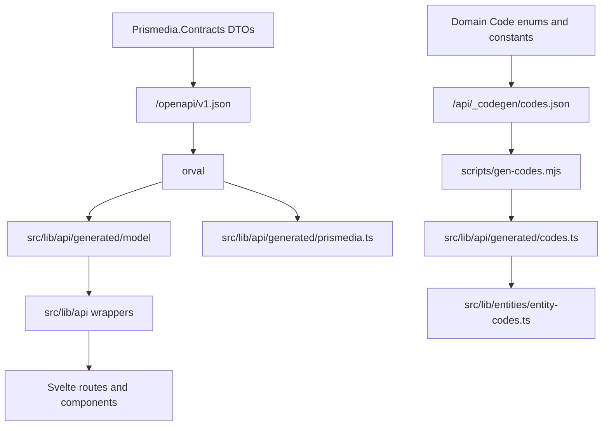

Any backend contract, OpenAPI operation, or `[Code]` enum change must be followed
by regenerating the frontend client with the dev API running. `pnpm api:check`
guards this by regenerating and failing if committed generated files are stale.

## Main User Journey Maps

### Browse To Playback

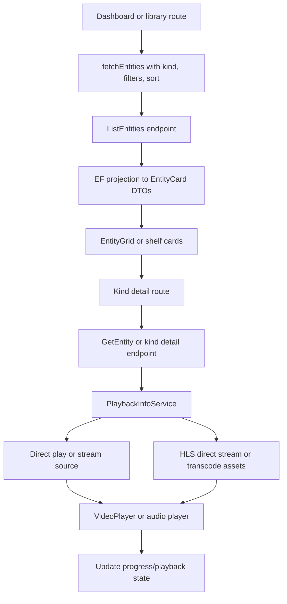

### New Media Scan

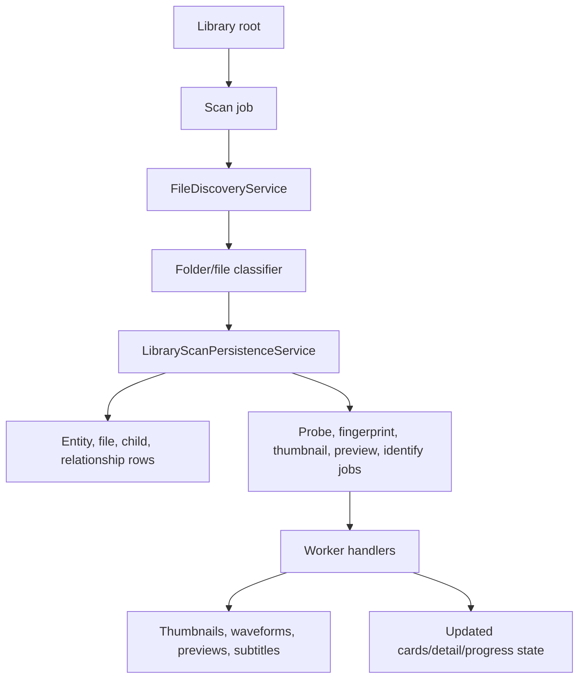

### Identify Review

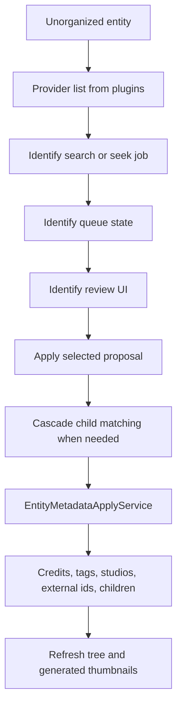

### Request Workflow

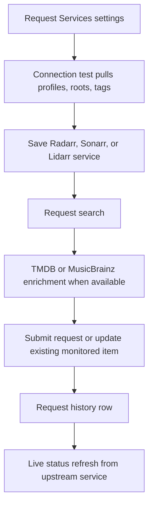

## Where To Start For Common Changes

| Change | Start here | Then inspect |
| --- | --- | --- |
| New library page or grid behavior | `apps/web-svelte/src/lib/components/entities/EntityIndexPage.svelte` | `EntityGrid.svelte`, `entity-grid.ts`, route page for the kind. |
| Detail page layout or metadata editing | `EntityDetail.svelte` | `entity-detail.ts`, `entity-detail-edit.ts`, kind detail route, update endpoints. |
| New API route | `Prismedia.Api/Endpoints/EndpointRouteBuilderExtensions.cs` | Matching endpoint group, `Prismedia.Contracts`, generated client. |
| New backend setting | `AppSettingKeys.cs` and `AppSettingsRegistry.cs` | Settings endpoints, generated codes, settings UI. |
| New closed-set code | Domain `[Code]` enum or constants manifest | `CodesManifest.cs`, `scripts/gen-codes.mjs`, `codes.ts`. |
| New media scan behavior | Scan handler for that family | `LibraryScanPersistenceService.*`, file classifier/parsing helpers, downstream job needs. |
| New worker job | `Prismedia.Application/Jobs/DependencyInjection.cs` | `JobType`, handler, queue tests, Jobs UI if surfaced. |
| Playback negotiation change | `PlaybackInfoService.cs` | `VideoDirectPlayPolicy`, `HlsAssetService*`, `VideoPlayer.svelte`, Jellyfin endpoints. |
| Plugin/identify behavior | `IdentifyPluginService*` or identify job handlers | Queue store, proposal traversal, apply service, identify UI store. |
| Request integration | `RequestEndpoints.cs` and request services | Arr clients, request contracts, settings UI, history tests. |

## Quality Snapshot

### Strong Signals

- The backend has an explicit architecture contract and a mechanical architecture
  audit script.
- Domain, Application, Infrastructure, API, Worker, and Contracts are split into
  separate projects with mostly inward dependencies.
- The Svelte client has a generated OpenAPI layer and a generated closed-code
  manifest layer.
- Tests exist across domain, infrastructure, API endpoints, frontend view-model
  helpers, Svelte components, and shared packages.
- `pnpm validate` ties together version/changelog checks, generated-client drift,
  Svelte checks, unit tests, docs build, and backend tests.
- Generated migrations and generated API files are isolated enough that large file
  size does not automatically imply hand-maintained complexity.

### Current Architecture Audit

The mechanical .NET architecture audit currently reports two medium findings:

| Severity | Location | Meaning |
| --- | --- | --- |
| Medium | `apps/backend/src/Prismedia.Api/Endpoints/Requests/RequestEndpoints.cs` | The endpoint imports `Prismedia.Domain.Entities` to decode request provider/media code enums. |
| Medium | `apps/backend/tests/Prismedia.Api.Tests/RequestEndpointTests.cs` | Tests use the same domain-coded request enums. |

This is a bounded issue rather than a broad layering collapse. Before release,
either document it as an intentional code-decoding boundary or move the request
decode surface behind API/contract-owned helpers so endpoint contracts do not
directly depend on domain namespaces.

### Hand-Maintained Hotspots

These files are not automatically bad; they are places where changes require
careful reading, focused tests, and a preference for extracting proven patterns
instead of adding one-off branches.

| Area | Hotspot | Why it matters |
| --- | --- | --- |
| Frontend detail surface | `EntityDetail.svelte` | Large shared page surface for many entity kinds. Small changes can affect movies, shows, books, images, audio, and taxonomy pages. |
| Frontend playback | `VideoPlayer.svelte` | Coordinates browser media events, HLS, fallback, progress, controls, and recovery. |
| Frontend grids | `EntityGrid.svelte`, `EntityGridToolbar.svelte`, `EntityThumbnail.svelte` | Shared browsing behavior, filtering, selection, thumbnails, previews, and mobile ergonomics. |
| Identify UI | `identify-store.svelte.ts`, identify review components | Long-running async state, provider selection, review/apply progress, and refresh survival. |
| API wrapper | `apps/web-svelte/src/lib/api/prismedia.ts` | Transitional wrapper around generated clients; useful but should not become a second contract layer. |
| Backend Jellyfin | `JellyfinCatalogService*`, Jellyfin endpoints | Compatibility surface with many legacy route shapes and client expectations. |
| Backend identify | `IdentifyQueueService`, `IdentifyPluginService*` | Async matching, provider behavior, queue state, cascade and apply paths. |
| Backend playback | `HlsAssetService*`, playback policy services | Direct play, direct stream, transcode, cache, seek, and process lifecycle all interact. |
| Backend scanning | `LibraryScanPersistenceService.*`, scan handlers | Converts files into canonical entities and downstream job work. |
| Backend queue | `JobQueueService`, `QueueWorker` | Durable work, visibility, retries, cancellation, concurrency, foreground lane behavior. |

### Low-Noise Findings

- TODO/FIXME comments are mostly inside vendored `foliate-js` reader code.
- One application job handler logs that provider metadata import has not yet been
  migrated; that appears to be an explicit placeholder, not hidden dead code.
- Generated files dominate the largest-file list only because EF migrations and
  generated API clients are necessarily verbose.

## Release Readiness Checklist

Before a release branch or release image, run the checks from the repo root:

```bash
pnpm validate
dotnet build apps/backend/Prismedia.slnx
pnpm docs:check
```

When backend contracts or `[Code]` enums changed, run the app at
`http://localhost:8008`, regenerate with:

```bash
pnpm --filter @prismedia/web-svelte api:generate
pnpm api:check
```

When runtime behavior changed, smoke the app through the .NET API at
`http://localhost:8008`, not Vite directly.

## Practical Mental Model

Use this path when you are lost:

```text
Route or user action
  -> shared frontend scaffold or page-local component
  -> src/lib/api wrapper
  -> generated OpenAPI operation
  -> Prismedia.Api endpoint group
  -> Application service, handler, or job handler
  -> Domain behavior if a business rule is involved
  -> Infrastructure EF/media/plugin adapter
  -> PostgreSQL rows or generated assets
  -> projected contract DTO
  -> generated TypeScript model
  -> screen state
```

If a proposed change skips a layer, ask why. Some read paths are intentionally
projection-first for speed, and some compatibility paths have external route
constraints, but those exceptions should be visible in code and tests.
