# Codebase Flow Map

This page is for a new developer who needs to understand how Prismedia moves from
screen to API to domain behavior to database and back again. It is a codebase map,
not an exhaustive component catalog.

## Read This First

Prismedia has three big rules that explain most of the repo:

1. The .NET backend owns server behavior, persistence, HTTP contracts, migrations,
   jobs, playback preparation, and integration adapters.
2. The Svelte app is a static frontend client. It calls the backend through
   generated OpenAPI clients and local presentation helpers.
3. Long-running media work is durable job work. It moves through PostgreSQL job
   rows and the .NET worker, not a TypeScript worker or browser process.
4. The native SwiftUI app is a separate client repository. It consumes the same
   canonical Entity routes and the same generated backend code manifest as Svelte.

## Runtime Shape

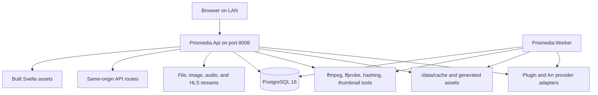
```mermaid
flowchart TD
  Browser["Browser on LAN"] --> Api["Prismedia.Api on port 8008"]
  Api --> Static["Built Svelte assets"]
  Api --> Http["Same-origin API routes"]
  Api --> Streams["File, image, audio, and HLS streams"]
  Api --> Db[("PostgreSQL 16")]
  Worker["Prismedia.Worker"] --> Db
  Worker --> MediaTools["ffmpeg, ffprobe, hashing, thumbnail tools"]
  Api --> MediaTools
  Api --> Cache["/data/cache and generated assets"]
  Worker --> Cache
  Api --> Plugins["Plugin and Arr provider adapters"]
  Worker --> Plugins
```

The API process also applies EF Core migrations on startup. The worker waits for
the database to be reachable and migrated before it begins claiming work.

## Code Layout At A Glance

| Area | Path | What it owns |
| --- | --- | --- |
| Web app | `apps/web-svelte` | Svelte routes, app chrome, stores, generated API client, entity grids/details, media players, readers. |
| API host | `apps/backend/src/Prismedia.Api` | Minimal API endpoint composition, auth, OpenAPI, static frontend hosting, codegen manifest, HTTP result mapping. |
| Contracts | `apps/backend/src/Prismedia.Contracts` | Public .NET request/response DTOs consumed by OpenAPI generation. |
| Application | `apps/backend/src/Prismedia.Application` | Use-case services, job handlers, ports, settings, security, playback policy, Jellyfin catalog projection. |
| Domain | `apps/backend/src/Prismedia.Domain` | Entity kinds, behavior-bearing entities, capabilities, coded enums, taxonomy concepts. |
| Infrastructure | `apps/backend/src/Prismedia.Infrastructure` | EF Core, row models, migrations, repositories/read services, media tools, plugins, requests, queue storage. |
| Worker | `apps/backend/src/Prismedia.Worker` | Hosted process that registers worker services and runs queue/scheduler hosted services. |
| Shared UI | `packages/ui-svelte` | Domain-free Svelte primitives, composed UI pieces, tokens, motion helpers. |
| Native app | `Prismedia-SwiftUI/PrismediaShared` in the sibling native repository | Swift Entity transport models, feature services/state, shared SwiftUI Entity detail and thumbnail presentation. |
| Documentation site | `documentation-site` | Docusaurus docs published separately from the app shell. |

## Dependency Direction

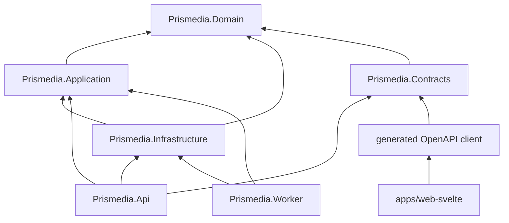
```mermaid
flowchart BT
  Domain["Prismedia.Domain"]
  Application["Prismedia.Application"]
  Infrastructure["Prismedia.Infrastructure"]
  Api["Prismedia.Api"]
  Worker["Prismedia.Worker"]
  Contracts["Prismedia.Contracts"]
  Web["apps/web-svelte"]

  Application --> Domain
  Infrastructure --> Application
  Infrastructure --> Domain
  Api --> Application
  Api --> Infrastructure
  Api --> Contracts
  Worker --> Application
  Worker --> Infrastructure
  Contracts --> Domain
  Web --> Generated["generated OpenAPI client"]
  Generated --> Contracts
```

The most important practical habit: when a feature touches a user action, start
at the route or endpoint, then follow the dependency direction inward. Do not
skip directly from a Svelte component into database-shaped assumptions.

## Request To Render Flow

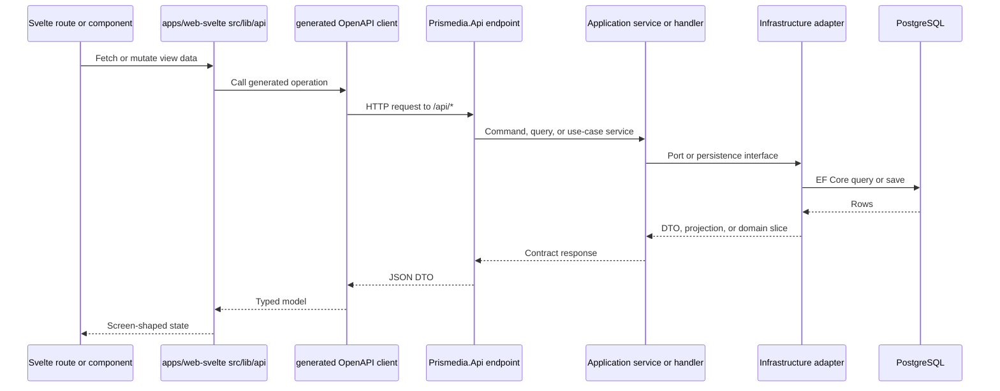
```mermaid
sequenceDiagram
  participant Page as Svelte route or component
  participant ApiWrapper as apps/web-svelte src/lib/api
  participant Generated as generated OpenAPI client
  participant Endpoint as Prismedia.Api endpoint
  participant App as Application service or handler
  participant Infra as Infrastructure adapter
  participant Db as PostgreSQL

  Page->>ApiWrapper: Fetch or mutate view data
  ApiWrapper->>Generated: Call generated operation
  Generated->>Endpoint: HTTP request to /api/*
  Endpoint->>App: Command, query, or use-case service
  App->>Infra: Port or persistence interface
  Infra->>Db: EF Core query or save
  Db-->>Infra: Rows
  Infra-->>App: DTO, projection, or domain slice
  App-->>Endpoint: Contract response
  Endpoint-->>Generated: JSON DTO
  Generated-->>ApiWrapper: Typed model
  ApiWrapper-->>Page: Screen-shaped state
```

Read-only endpoints often project EF rows directly into contract DTOs. Writes
should flow through a command or use-case service, call domain behavior where
there is a business invariant, and save once per use case whenever possible.

## Frontend Flow

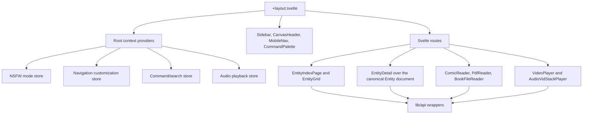
```mermaid
flowchart TD
  Layout["+layout.svelte"] --> Providers["Root context providers"]
  Providers --> Nsfw["NSFW mode store"]
  Providers --> Nav["Navigation customization store"]
  Providers --> Search["Command/search store"]
  Providers --> Audio["Audio playback store"]
  Layout --> Chrome["Sidebar, CanvasHeader, MobileNav, CommandPalette"]
  Layout --> Routes["Svelte routes"]
  Routes --> Index["EntityIndexPage and EntityGrid"]
  Routes --> Detail["EntityDetail over the canonical Entity document"]
  Routes --> Readers["ComicReader, PdfReader, BookFileReader"]
  Routes --> Players["VideoPlayer and AudioVidStackPlayer"]
  Index --> Api["lib/api wrappers"]
  Detail --> Api
  Readers --> Api
  Players --> Api
```

The frontend is route-driven, but the reusable entity scaffolds carry a lot of
the product surface:

- `EntityIndexPage` owns the common library page shell.
- `EntityGrid`, `EntityGridToolbar`, `EntityGridFilterDrawer`, and pagination
  modules own browsing, filtering, selection, and view modes.
- `EntityDetail` owns the shared detail surface for descriptions, metadata,
  images, relationships, children, progress, and edit actions.
- `EntityThumbnail` owns grid card rendering, artwork fallbacks, preview hover,
  badges, progress, and reference chips.
- Route pages usually choose kind-specific configuration and delegate to shared
  scaffolds instead of rebuilding layouts from scratch.

The SwiftUI app follows the same Entity API root through `PrismediaAPIClient`,
`PrismediaEntityDetailLoader`, feature-owned service/state, and shared native
detail/thumbnail presentation. See
[Entity Definitions and Data Flow](./entity-definitions-and-data-flow.md) for the
object-level backend, Svelte, and Swift diagrams.

## API Surface Flow

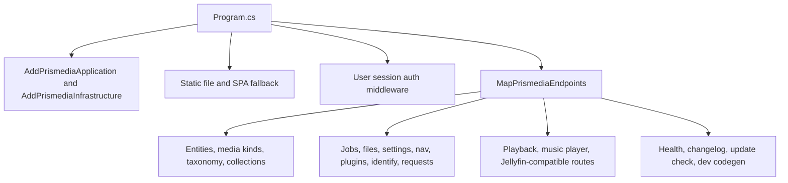
```mermaid
flowchart TD
  Program["Program.cs"] --> Services["AddPrismediaApplication and AddPrismediaInfrastructure"]
  Program --> StaticHost["Static file and SPA fallback"]
  Program --> Auth["User session auth middleware"]
  Program --> Endpoints["MapPrismediaEndpoints"]
  Endpoints --> EntityRoutes["Entities, media kinds, taxonomy, collections"]
  Endpoints --> OpsRoutes["Jobs, files, settings, nav, plugins, identify, requests"]
  Endpoints --> PlaybackRoutes["Playback, music player, Jellyfin-compatible routes"]
  Endpoints --> SystemRoutes["Health, changelog, update check, dev codegen"]
```

Endpoint files should stay thin. They decode HTTP-shaped input, call application
services, and return explicit contract DTOs or `ApiProblem` responses.

Important groups currently mapped:

| Group | Primary route area | Typical owner |
| --- | --- | --- |
| Entity browse/detail | `/api/entities`; kind aliases return the same document | `IEntityReadService`, `EntityCardProjector`, generated `EntityCard`. |
| Library roots | `/api/libraries` | Settings and scan-root persistence. |
| Files | `/api/files` | `FilesService`, managed storage, file persistence. |
| Jobs | `/api/jobs` | `JobService`, `IJobGraphService`, `IJobQueueService`, durable graph/node/signal/resource rows. |
| Identify | `/api/identify` | Plugin services, identify queues, cascade runners. |
| Requests | `/api/requests` | Radarr, Sonarr, Lidarr clients and history stores. |
| Playback | `/api/playback`, `/api/music-player`, Jellyfin routes | Playback services, HLS assets, stream sources. |
| Settings/auth | `/api/settings`, `/api/auth`, `/api/users` | Settings registry, user authentication, and user administration services. |

## Durable Job Flow

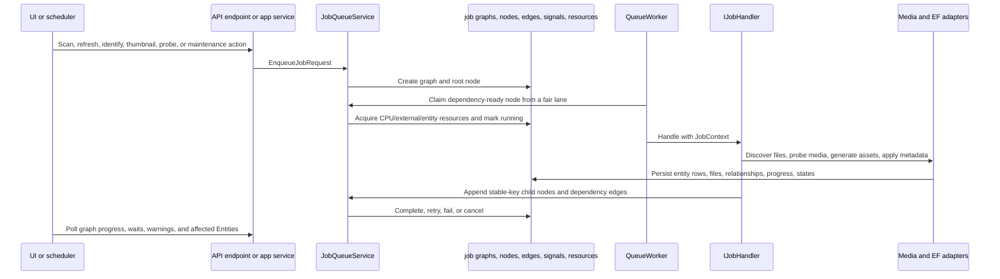
```mermaid
sequenceDiagram
  participant UI as UI or scheduler
  participant API as API endpoint or app service
  participant Queue as JobQueueService
  participant Db as job graphs, nodes, edges, signals, resources
  participant Worker as QueueWorker
  participant Handler as IJobHandler
  participant Infra as Media and EF adapters

  UI->>API: Scan, refresh, identify, thumbnail, probe, or maintenance action
  API->>Queue: EnqueueJobRequest
  Queue->>Db: Create graph and root node
  Worker->>Queue: Claim dependency-ready node from a fair lane
  Queue->>Db: Acquire CPU/external/entity resources and mark running
  Worker->>Handler: Handle with JobContext
  Handler->>Infra: Discover files, probe media, generate assets, apply metadata
  Infra->>Db: Persist entity rows, files, relationships, progress, states
  Handler->>Queue: Append stable-key child nodes and dependency edges
  Queue->>Db: Complete, retry, fail, or cancel
  UI->>API: Poll graph progress, waits, warnings, and affected Entities
```

Registered handler families:

| Family | Examples | What they do |
| --- | --- | --- |
| Scanning | `ScanLibraryJobHandler`, `ScanGalleryJobHandler`, `ScanBookJobHandler`, `ScanAudioJobHandler` | Walk roots, classify folders/files, upsert entities, enqueue downstream work. |
| Probe | `ProbeVideoJobHandler`, `ProbeAudioJobHandler` | Run media probes and persist technical metadata. |
| Fingerprint | `FingerprintJobHandler` for video, image, audio | Compute MD5/oshash-style fingerprints where enabled and needed. |
| Asset generation | Grid thumbnails, image thumbnails, book covers/pages, audio waveforms, video previews, subtitles | Produce generated assets and capability state. |
| Identify | Search, one-provider-per-Entity expansion, reviewed apply, auto identify | Call providers/plugins, wait durably for review, apply metadata, and append structural work in the same lane. |
| Acquisition | Search, monitor, import, upgrade replace, finalize | Wait for review/transfers, materialize exact Entities and files, reconcile readiness, and finalize usable imports. |
| Maintenance | Refresh entity, refresh collection, library maintenance | Keep derived views and stale records tidy. |

## Entity And Capability Flow

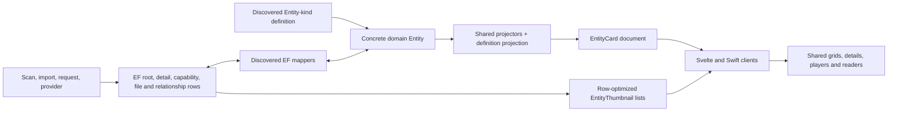
```mermaid
flowchart LR
  Definition["Discovered Entity-kind definition"] --> DomainEntity["Concrete domain Entity"]
  FileSystem["Scan, import, request, provider"] --> Rows["EF root, detail, capability, file and relationship rows"]
  Rows <--> Mappers["Discovered EF mappers"]
  Mappers <--> DomainEntity
  DomainEntity --> Projection["Shared projectors + definition projection"]
  Projection --> Contracts["EntityCard document"]
  Rows --> Thumbnails["Row-optimized EntityThumbnail lists"]
  Contracts --> Clients["Svelte and Swift clients"]
  Thumbnails --> Clients
  Clients --> UI["Shared grids, details, players and readers"]
```

Conceptually, a definition describes a kind, a domain `Entity` carries one
instance's behavior/state, EF rows persist it, and `EntityCard` projects one
shared detail document. Mutable domain capabilities, immutable document
capabilities, and application projector modules are different concerns. The
[focused Entity guide](./entity-definitions-and-data-flow.md) documents their
construction, registration, persistence, and review rules in detail.

## Generated Client And Code Constants

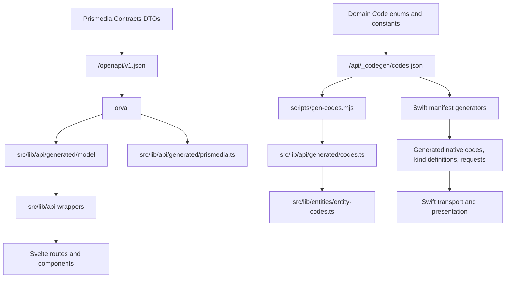
```mermaid
flowchart TD
  BackendContracts["Prismedia.Contracts DTOs"] --> OpenApi["/openapi/v1.json"]
  CodeEnums["Domain Code enums and constants"] --> CodeManifest["/api/_codegen/codes.json"]
  OpenApi --> Orval["orval"]
  CodeManifest --> GenCodes["scripts/gen-codes.mjs"]
  Orval --> GeneratedModels["src/lib/api/generated/model"]
  Orval --> GeneratedOps["src/lib/api/generated/prismedia.ts"]
  GenCodes --> CodesTs["src/lib/api/generated/codes.ts"]
  CodeManifest --> SwiftGen["Swift manifest generators"]
  SwiftGen --> SwiftCodes["Generated native codes, kind definitions, requests"]
  GeneratedModels --> ApiWrappers["src/lib/api wrappers"]
  CodesTs --> EntityCodes["src/lib/entities/entity-codes.ts"]
  ApiWrappers --> UI["Svelte routes and components"]
  SwiftCodes --> NativeUI["Swift transport and presentation"]
```

Any backend contract, OpenAPI operation, definition, or coded-enum change must be
followed by regenerating the affected clients with the dev API running.
`pnpm api:check` guards Svelte parity; the native repository's
`Scripts/check-contract-codes.py` validates its generated manifest surfaces.

## Main User Journey Maps

### Browse To Playback

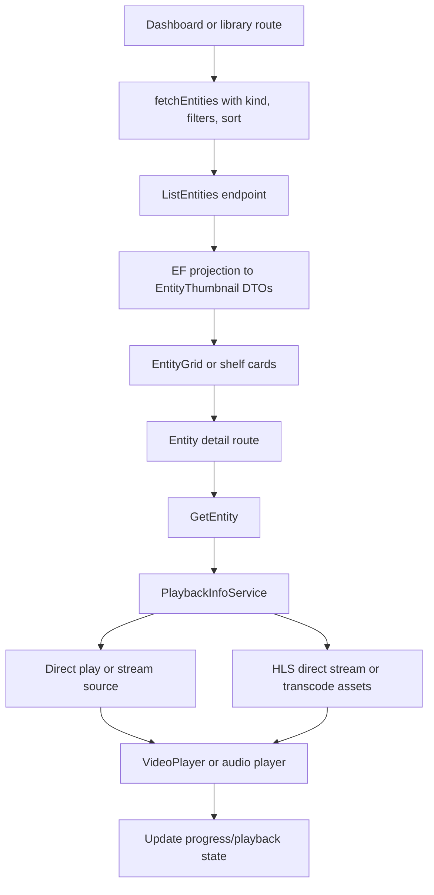
```mermaid
flowchart TD
  Dashboard["Dashboard or library route"] --> Fetch["fetchEntities with kind, filters, sort"]
  Fetch --> EntityList["ListEntities endpoint"]
  EntityList --> Projection["EF projection to EntityThumbnail DTOs"]
  Projection --> Grid["EntityGrid or shelf cards"]
  Grid --> Detail["Entity detail route"]
  Detail --> DetailEndpoint["GetEntity"]
  DetailEndpoint --> PlayerDecision["PlaybackInfoService"]
  PlayerDecision --> Direct["Direct play or stream source"]
  PlayerDecision --> HLS["HLS direct stream or transcode assets"]
  Direct --> Player["VideoPlayer or audio player"]
  HLS --> Player
  Player --> Progress["Update progress/playback state"]
```

### New Media Scan

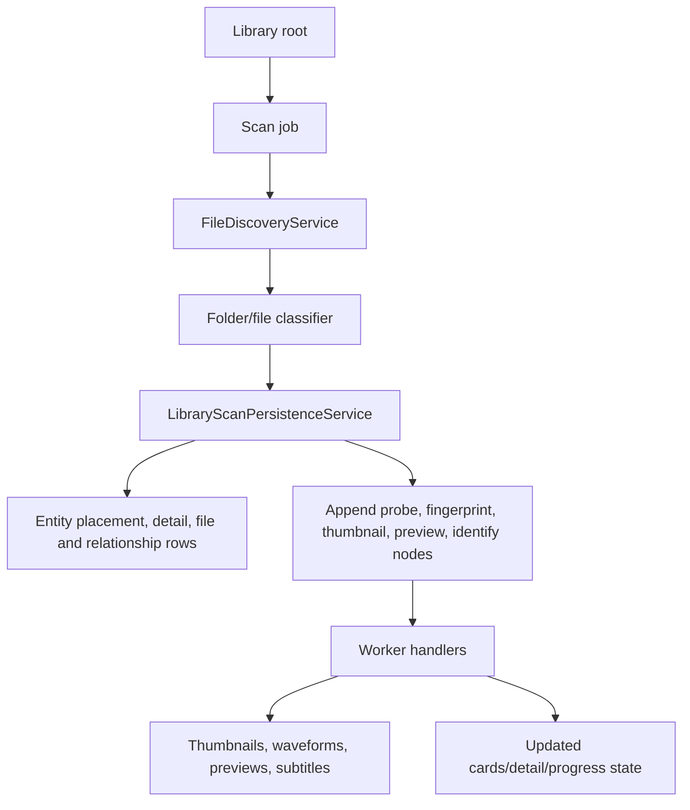
```mermaid
flowchart TD
  Root["Library root"] --> ScanJob["Scan job"]
  ScanJob --> Discovery["FileDiscoveryService"]
  Discovery --> Classifier["Folder/file classifier"]
  Classifier --> Upsert["LibraryScanPersistenceService"]
  Upsert --> EntityRows["Entity placement, detail, file and relationship rows"]
  Upsert --> Downstream["Append probe, fingerprint, thumbnail, preview, identify nodes"]
  Downstream --> Workers["Worker handlers"]
  Workers --> GeneratedAssets["Thumbnails, waveforms, previews, subtitles"]
  Workers --> UpdatedDetail["Updated cards/detail/progress state"]
```

### Identify Review

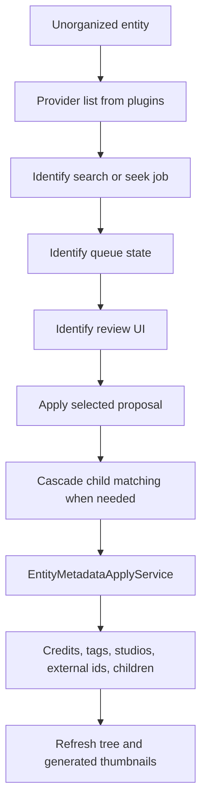
```mermaid
flowchart TD
  Item["Unorganized entity"] --> Providers["Provider list from plugins"]
  Providers --> Search["Identify search or seek job"]
  Search --> QueueState["Identify queue state"]
  QueueState --> Review["Identify review UI"]
  Review --> Apply["Apply selected proposal"]
  Apply --> Cascade["Cascade child matching when needed"]
  Cascade --> Metadata["EntityMetadataApplyService"]
  Metadata --> Relationships["Credits, tags, studios, external ids, children"]
  Relationships --> Refresh["Refresh tree and generated thumbnails"]
```

### Request Workflow

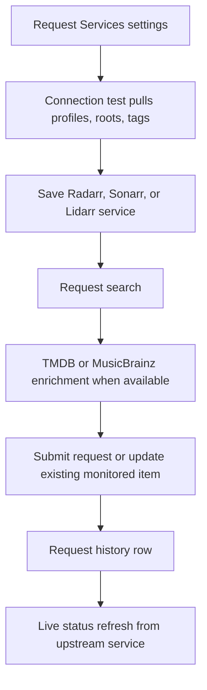
```mermaid
flowchart TD
  Settings["Request Services settings"] --> Test["Connection test pulls profiles, roots, tags"]
  Test --> Save["Save Radarr, Sonarr, or Lidarr service"]
  Save --> Search["Request search"]
  Search --> Enrich["TMDB or MusicBrainz enrichment when available"]
  Enrich --> Submit["Submit request or update existing monitored item"]
  Submit --> History["Request history row"]
  History --> LiveStatus["Live status refresh from upstream service"]
```

## Where To Start For Common Changes

| Change | Start here | Then inspect |
| --- | --- | --- |
| New library page or grid behavior | `apps/web-svelte/src/lib/components/entities/EntityIndexPage.svelte` | `EntityGrid.svelte`, `entity-grid.ts`, route page for the kind. |
| Detail page layout or metadata editing | `EntityDetail.svelte` | `entity-detail.ts`, `entity-detail-edit.ts`, canonical Entity read, update endpoints. |
| New Entity kind or kind-wide policy | Concrete Entity file and `EntityKindDefinition` | `EntityKindRegistry`, mapper only when detail state persists, code manifest, both generated clients. |
| New Entity capability | Domain or document capability beside its owner | Capability mapper/projector, polymorphism discovery, generated clients and native decoder. |
| New API route | `Prismedia.Api/Endpoints/EndpointRouteBuilderExtensions.cs` | Matching endpoint group, `Prismedia.Contracts`, generated client. |
| New backend setting | `AppSettingKeys.cs` and `AppSettingsRegistry.cs` | Settings endpoints, generated codes, settings UI. |
| New closed-set code | Domain `[Code]` enum or constants manifest | `CodesManifest.cs`, `scripts/gen-codes.mjs`, `codes.ts`. |
| New media scan behavior | Scan handler for that family | `LibraryScanPersistenceService.*`, file classifier/parsing helpers, downstream job needs. |
| New worker job | `Prismedia.Application/Jobs/DependencyInjection.cs` | `JobType`, handler, queue tests, Jobs UI if surfaced. |
| Playback negotiation change | `PlaybackInfoService.cs` | `VideoDirectPlayPolicy`, `HlsAssetService*`, `VideoPlayer.svelte`, Jellyfin endpoints. |
| Plugin/identify behavior | `IdentifyPluginService*` or identify job handlers | Queue store, proposal traversal, apply service, identify UI store. |
| Request integration | `RequestEndpoints.cs` and request services | Arr clients, request contracts, settings UI, history tests. |

## Quality Snapshot

### Strong Signals

- The backend has an explicit architecture contract and a mechanical architecture
  audit script.
- Domain, Application, Infrastructure, API, Worker, and Contracts are split into
  separate projects with mostly inward dependencies.
- The Svelte client has a generated OpenAPI layer and a generated closed-code
  manifest layer.
- The native client generates closed codes, complete Entity-kind definitions, and
  request definitions from that same backend manifest.
- Tests exist across domain, infrastructure, API endpoints, frontend view-model
  helpers, Svelte components, and shared packages.
- `pnpm validate` ties together version/changelog checks, generated-client drift,
  Svelte checks, unit tests, docs build, and backend tests.
- Generated migrations and generated API files are isolated enough that large file
  size does not automatically imply hand-maintained complexity.

### Architecture Audits

Do not preserve a dated analyzer result in this page. Run the current architecture
tests and validation against the commit being reviewed, then inspect each result
against the dependency rules above. Test-only references, generated contracts,
and external adapter boundaries may need different treatment from production
layer violations.

### Hand-Maintained Hotspots

These files are not automatically bad; they are places where changes require
careful reading, focused tests, and a preference for extracting proven patterns
instead of adding one-off branches.

| Area | Hotspot | Why it matters |
| --- | --- | --- |
| Frontend detail surface | `EntityDetail.svelte` | Large shared page surface for many entity kinds. Small changes can affect movies, shows, books, images, audio, and taxonomy pages. |
| Frontend playback | `VideoPlayer.svelte` | Coordinates browser media events, HLS, fallback, progress, controls, and recovery. |
| Frontend grids | `EntityGrid.svelte`, `EntityGridToolbar.svelte`, `EntityThumbnail.svelte` | Shared browsing behavior, filtering, selection, thumbnails, previews, and mobile ergonomics. |
| Identify UI | `identify-store.svelte.ts`, identify review components | Long-running async state, provider selection, review/apply progress, and refresh survival. |
| API wrapper | `apps/web-svelte/src/lib/api/prismedia.ts` | Transitional wrapper around generated clients; useful but should not become a second contract layer. |
| Backend Jellyfin | `JellyfinCatalogService*`, Jellyfin endpoints | Compatibility surface with many legacy route shapes and client expectations. |
| Backend identify | `IdentifyQueueService`, `IdentifyPluginService*` | Async matching, provider behavior, queue state, cascade and apply paths. |
| Backend playback | `HlsAssetService*`, playback policy services | Direct play, direct stream, transcode, cache, seek, and process lifecycle all interact. |
| Backend scanning | `LibraryScanPersistenceService.*`, scan handlers | Converts files into canonical entities and downstream job work. |
| Backend queue | `JobGraphService`, `JobQueueService`, `QueueWorker` | Dependencies, durable waits, fair interactive/background lanes, CPU/provider/entity resources, visibility, retries, and cancellation. |

### Low-Noise Findings

- TODO/FIXME comments are mostly inside vendored `foliate-js` reader code.
- One application job handler logs that provider metadata import has not yet been
  migrated; that appears to be an explicit placeholder, not hidden dead code.
- Generated files dominate the largest-file list only because EF migrations and
  generated API clients are necessarily verbose.

## Release Readiness Checklist

Before a release branch or release image, run the checks from the repo root:

```bash
pnpm validate
dotnet build apps/backend/Prismedia.slnx
pnpm docs:check
```

When backend contracts or `[Code]` enums changed, run the app at
`http://localhost:8008`, regenerate with:

```bash
pnpm --filter @prismedia/web-svelte api:generate
pnpm api:check
```

When runtime behavior changed, smoke the app through the .NET API at
`http://localhost:8008`, not Vite directly.

## Practical Mental Model

Use this path when you are lost:

```text
Route or user action
  -> shared frontend scaffold or page-local component
  -> src/lib/api wrapper
  -> generated OpenAPI operation
  -> Prismedia.Api endpoint group
  -> Application service, handler, or job handler
  -> Domain behavior if a business rule is involved
  -> Infrastructure EF/media/plugin adapter
  -> PostgreSQL rows or generated assets
  -> projected contract DTO
  -> generated TypeScript model
  -> screen state
```

If a proposed change skips a layer, ask why. Some read paths are intentionally
projection-first for speed, and some compatibility paths have external route
constraints, but those exceptions should be visible in code and tests.
