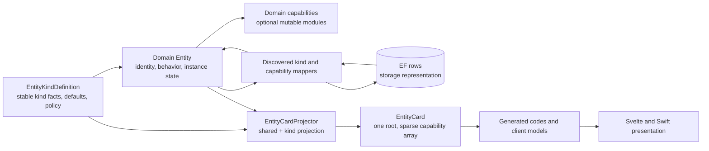
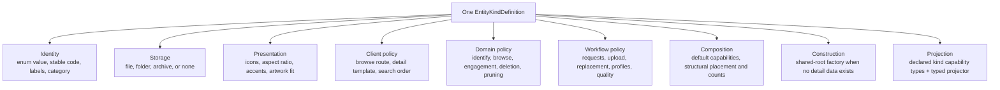
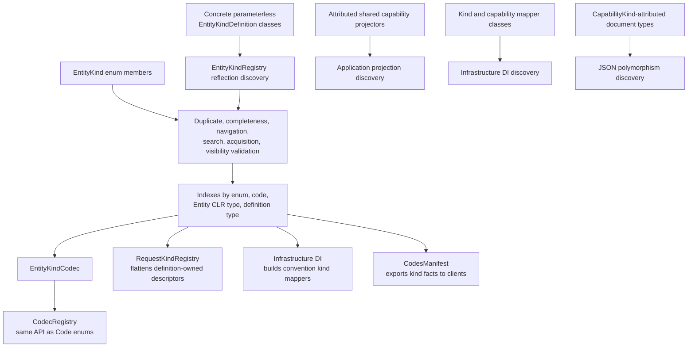
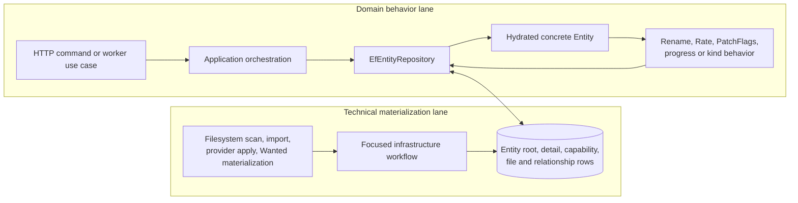
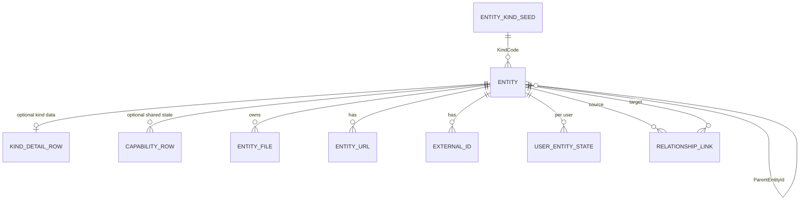
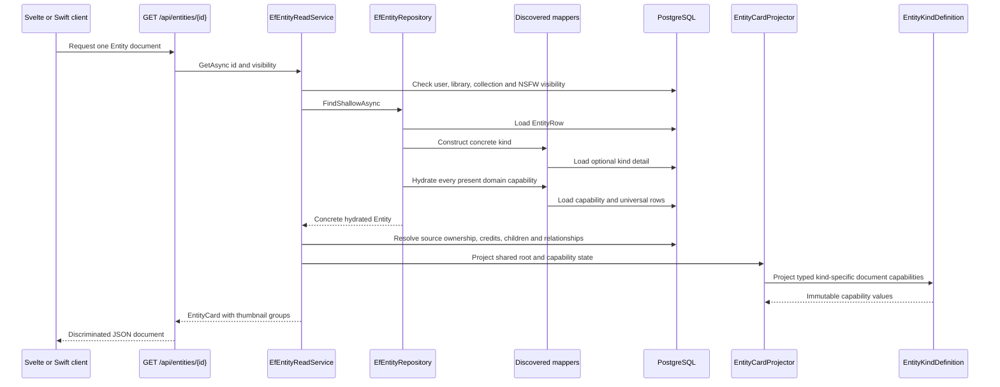
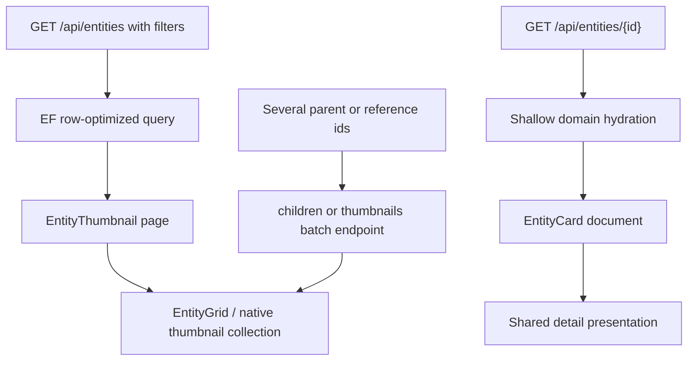
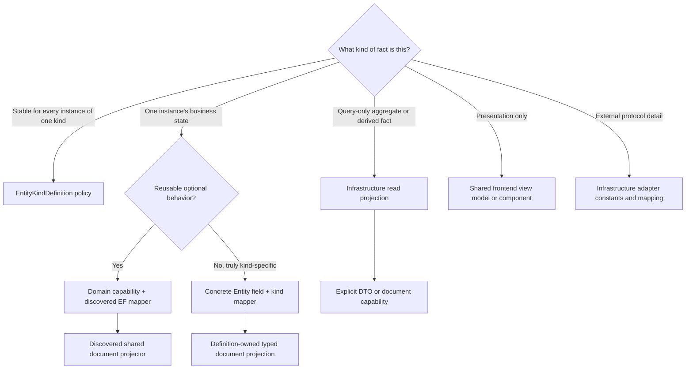
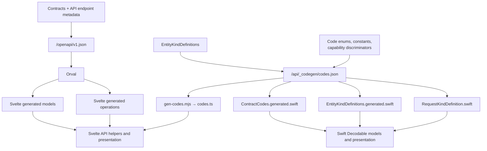
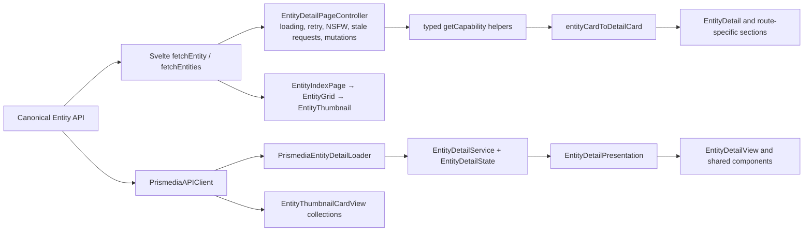

# Entity Definitions and Data Flow

This is the review map for Prismedia's Entity system. Use it when adding a kind,
adding a capability, tracing an incorrect field, or deciding whether code belongs
in the shared root, a kind definition, persistence, an API projection, or one of
the frontends.

The central rule is:

> A definition describes an Entity kind. An Entity carries one instance's behavior
> and state. EF rows persist that state. An Entity document projects it for clients.
> Frontend view models decide how to present it.

Those are related objects, but they are deliberately not one object shared across
every layer.

## One-Minute Mental Model



The definition is a singleton description of a **type**. The Entity is a runtime
object for one library item. A database row is its **storage form**, and
`EntityCard` is its **read contract**. Do not copy a property across all four just
because it exists in one of them.

## The Data Objects

| Object | Meaning | Canonical location |
| --- | --- | --- |
| `EntityKind` | Closed typed identity. It has no independently maintained string code. | `Prismedia.Domain/Entities/Kinds/EntityKind.cs` |
| `EntityKindDefinition` | Immutable, discovered description of one kind: code, names, storage shape, presentation, navigation, behavior, workflows, defaults, and kind projection. | Beside the concrete Entity under `Prismedia.Domain/Media` or `Prismedia.Domain/Taxonomy` |
| `Entity` | Shared domain root for one item: id, title, structural placement, universal state, attached capabilities, children, relationships, files, and intent-bearing mutation methods. | `Prismedia.Domain/Entities/Entity.cs` |
| Concrete Entity | State and behavior that genuinely belongs to one kind, such as `Book.Format` or `Collection.Mode`. | The same file as its definition where practical |
| Domain capability | Optional mutable behavior/state module, such as dates, playback, progress, credits, or technical metadata. | `Prismedia.Domain/Capabilities` |
| EF row | PostgreSQL storage shape. Rows are infrastructure details, not domain objects or API DTOs. | `Prismedia.Infrastructure/Persistence/Entities` |
| Kind mapper | Constructs and persists a concrete Entity when it has kind-specific stored data. | `Prismedia.Infrastructure/Entities/Mappers/Kinds` |
| Capability mapper | Hydrates, clears, and persists one domain capability's rows. | `Prismedia.Infrastructure/Entities/Mappers/Capabilities` |
| Document capability | Immutable, discriminated API value inside `EntityCard.capabilities`. It may project a domain capability, a universal root fact, or kind-specific Entity state. | Shared values in `Prismedia.Contracts/Entities/Capabilities`; kind-owned values in `Prismedia.Domain/Entities/Documents` |
| `EntityThumbnail` | Read-optimized list/grid projection. It is intentionally not a complete Entity document. | `Prismedia.Contracts/Entities` and `EfEntityReadService` |
| `EntityCard` | Concrete shared detail document implementing the `IEntityRef` → `IEntitySummary` → `IEntityDocument` contract ladder. | `Prismedia.Contracts/Entities/EntityCards.cs` |
| Frontend model | Generated wire type plus app-local presentation state. It is not a second backend domain model. | Svelte `src/lib/entities`; Swift `PrismediaShared/Domain/Entities` and feature presentation models |

Search candidates, identify proposals, acquisition releases, and request previews
are not Entities. They can describe a possible Entity or mutation without gaining a
fake Entity id, capability array, or persistence lifecycle.

## What One Kind Definition Owns

Every value that is stable for all instances of one kind should be considered for
its `EntityKindDefinition` before creating another switch, map, or registry.



For example, `BookEntityKindDefinition` owns the stable `book` code, labels,
archive storage shape, thumbnail presentation, routes, identify policy, default
progress/playback capabilities, structural counts, request descriptors, allowed
root/parent placement, acquisition profile, and the projection of `BookType`,
`Format`, and cover choice.
The `Book` object owns the actual values and reading behavior for one book.

Definitions use two construction forms:

- `RootEntityKindDefinition<TEntity>` is for a type whose complete construction
  needs only `EntityRow` fields. Its definition supplies the factory, and
  infrastructure creates a convention mapper automatically.
- `EntityKindDefinition<TEntity>` is for a type with additional stored state. A
  discovered `IEntityKindMapper` reads its detail row and invokes its constructor.

`AudioEntityKindDefinition` is the deliberate protocol-only exception: it has a
kind identity and shared policy but no concrete persisted Entity CLR type.

## Discovery and Fail-Fast Validation

There is no central hand-maintained list of Entity kinds. Discovery is dynamic
within the compiled assemblies; it is not runtime plugin loading from arbitrary
external assemblies.



At startup, the system rejects:

- an `EntityKind` with no definition;
- duplicate kind identities, stable codes, Entity CLR types, request kinds, or
  capability discriminators;
- invalid navigation topology or non-contiguous search ordering;
- inconsistent request/acquisition-profile policy;
- missing or invalid structural-placement policy;
- a definition that declares one set/order of kind capabilities but projects
  another;
- duplicate capability types in defaults or in one projected document.

The compile-time binding `Entity<TDefinition>` also prevents each concrete Entity
from repeating a kind property or consulting a switch. Its constructor resolves
the one discovered definition of `TDefinition`.

### What discovery does not invent

Discovery removes registration sprawl, but it cannot infer new data semantics.
A new stored field can still require an EF row and migration. A new wire payload
still requires a document type. Swift still needs a concrete decoder for a new
payload shape. A genuinely new destination still needs UI. The goal is one local
implementation of each required concern, not pretending those concerns are the
same layer.

## How Entity Data Is Created

There are two intentional write lanes.



Scans and imports are high-volume technical workflows. They often upsert
`EntityRow`, detail, file, and relationship rows directly because their job is to
materialize discovered storage truth, not execute an aggregate business behavior.
The next domain read constructs the concrete Entity from those rows. These focused
writers still pass structural assignments through `EntityStructurePlacementValidator`,
which resolves the actual parent kind and rejects cycles only when placement changes.
It is an invariant boundary, not a universal repository or global change-tracker hook.

User mutations and business operations load an Entity through
`EfEntityRepository`, call behavior, and persist it through the discovered
mappers. A focused persistence service is still appropriate when an operation is
technical, bulk-oriented, or does not need domain behavior. The review question is
whether an invariant is being bypassed, not whether every write happens through
one universal repository.

## Persistence Shape

The following is conceptual. `KIND_DETAIL_ROW` and `CAPABILITY_ROW` each represent
several concrete tables.



Important details:

- Structural hierarchy is `EntityRow.ParentEntityId`; there is no required
  in-memory global Entity graph.
- Every kind explicitly declares whether it may be a root and which direct parent
  kinds it accepts. Parent declarations are canonical; inverse child lists are derived.
- `Entity.AddChild`, repository hydration/save, wanted materialization, provider
  structure application, and scan persistence enforce the same discovered policy.
- Non-structural relationships and credit edge metadata live in explicit link
  rows.
- Rating, favorite, playback, and reading progress are per-user facts in
  `UserEntityStateRow`, even though the hydrated Entity offers convenient behavior.
- Source ownership is a derived subtree fact based on source-role files. Clients
  must not infer it from a kind or an incidental detail row.
- Kind codes are stored as stable strings resolved by `EntityKindCodec`; changing
  one is a schema/data compatibility decision, not a display-label edit.

## Detail Read and Projection Flow

Both frontends use `GET /api/entities/{id}` for the canonical detail document.
Kind-specific writes, child operations, and playback routes remain separate where
their commands genuinely differ.



`FindShallowAsync` intentionally does not recursively hydrate every child and
relationship. `EfEntityReadService` uses bounded row projections for child and
relationship thumbnails, then replaces the empty groups on the projected card.
That prevents one detail read from constructing a large object network.

Shared document capabilities are produced by discovered application projectors.
Each projector receives one context and either returns its typed capability or
`null`. Kind-specific immutable capabilities are produced by the strongly typed
method on the Entity's definition. The registry combines both sets and rejects
duplicates.

Clients must select capabilities by discriminator, never by array position. Output
ordering is deterministic for readable JSON and stable tests, but order has no
domain meaning.

## List and Batch Reads Are Deliberately Different



Lists do not call the detail endpoint once per result. They project
`EntityThumbnail` directly from EF rows and contributors. When a page needs several
known children or references, use `/api/entities/children` or
`/api/entities/thumbnails`. Repeated `fetchEntity` calls in a collection loop are a
review signal for a missing batch projection or an unnecessarily rich UI need.

## Capability Lifecycle

The word “capability” covers three related but distinct things:

| Form | Use it when | Example path |
| --- | --- | --- |
| Mutable domain capability | An optional state/behavior module can be attached to an Entity and has a persistence lifecycle. It may be used by one kind today and still be the right abstraction. | `CapabilityDates` → `DatesCapabilityMapper` → `DatesCapabilityProjector` |
| Kind-owned document capability | A concrete Entity has kind-specific state that clients need, but no reusable mutable module is required. | `Book.Format` → `BookEntityKindDefinition.ProjectCapabilities` → `BookMetadataCapability` |
| Universal document capability | The API needs a uniform view of root or request-scoped facts with no one-to-one domain capability. | rating, flags, images, links, file management |

Every document capability type owns its wire discriminator through
`[CapabilityKind("...")]`. `CapabilityPolymorphism` discovers all attributed
subtypes rather than maintaining a `JsonDerivedType` chain. The same discriminator
set is emitted in the code manifest.

Use this decision tree before adding a field:



Do not put EF queries, `DbContext`, HTTP route construction, JSON parsing, or
platform UI types on a definition. Moving stable semantic policy into the
definition reduces sprawl; moving adapter mechanics there couples the domain to
things that change for unrelated reasons.

## Contract and Code Generation



Svelte receives endpoint operations and DTO types through OpenAPI/Orval, and all
closed codes and kind definitions through `codes.ts`. It should not declare a
parallel wire union.

Swift receives closed codes, complete kind definitions, and request definitions
from the same backend manifest. Its `EntityDetail` transport model is currently a
native `Decodable` type. `EntityCapability` is an explicit Swift sum type with an
`unknown` fallback, so adding a new capability payload requires either a matching
native case/decoder or accepting it as unknown until the app catches up. The
manifest parity scripts protect code values; they do not generate every payload
struct today.

## Frontend Data Flow



The two apps use the same API roots and semantic document. They are not expected
to share presentation source code:

- Svelte's controller owns cancellation generations, retry/loading state, NSFW
  reloads, breadcrumbs, and optimistic shared metadata mutations. Routes should
  provide only their load function, breadcrumbs, and truly kind-specific data.
- Swift's `EntityDetailService` performs I/O while `EntityDetailState` owns request
  generations, loading/failure state, and mutation refresh. Presentation is derived
  from capabilities by `EntityDetailPresentation`.
- Entity lists should reach `EntityGrid`/`EntityThumbnail` on Svelte and the shared
  native thumbnail card surface on Swift. A new route-local Entity card is usually
  duplication.
- Playback may keep platform-specific orchestration. The shared contract and kind
  roots still apply, but video playback behavior is intentionally not being unified.

## Adding an Entity Kind

Use this order:

1. Add the typed `EntityKind` member. Do not add a code attribute; the definition
   owns the stable code.
2. Add one parameterless definition beside the concrete Entity. Fill in identity,
   storage, presentation, navigation/search, and `EntityKindBehavior`.
3. Bind the concrete type through `Entity<TDefinition>`. Use a root factory only
   if shared root fields are sufficient.
4. Declare default domain capabilities, optional facets, request descriptors,
   acquisition profile, containment, and structural thumbnail counts locally.
5. If the type has specific stored state, add its detail row, EF configuration,
   migration, and one discovered `IEntityKindMapper`. Otherwise the convention
   mapper is automatic.
6. Add any kind-owned document capability types, declare their exact order in
   `ProjectedCapabilityTypes`, and project them in the typed definition method.
7. Regenerate Svelte OpenAPI/codes and the three Swift manifest outputs.
8. Add UI only for behavior that the shared grid/detail scaffolds cannot express.
9. Test the domain invariant, mapper round trip, contract projection, and one real
   client behavior. Do not create tests for every constructor assignment.

You should **not** edit:

- `EntityKindRegistry`;
- `CodecRegistry` or `EntityKindCodec`;
- `RequestKindRegistry`;
- a central kind-to-label, kind-to-icon, kind-to-route, or kind-to-acquisition map;
- hand-written TypeScript or Swift raw-value lists covered by generation.

If adding a kind requires one of those edits, first ask whether a semantic fact is
missing from the definition or manifest.

## Adding a Capability

Choose one of these paths:

### Reusable mutable capability

1. Add the domain capability and its behavior.
2. Add one discovered `IEntityCapabilityMapper` if it persists.
3. Add the immutable document capability with `[CapabilityKind]`.
4. Add one attributed `EntityCapabilityProjector<T>` whose `Project` method returns
   a value when applicable and `null` otherwise.
5. Add the capability to kind defaults only where it should exist by default.
6. Regenerate clients and add the concrete Swift payload decoder if native uses it.

No registry list changes are required.

### Truly kind-specific document data

1. Keep the state on the concrete Entity and persist it in its kind mapper.
2. Put the immutable capability beside the definition.
3. Add its type to `ProjectedCapabilityTypes` and return it from the typed projector.
4. Regenerate clients and update native decoding when needed.

Do not create an empty mutable domain capability solely to make an API value look
like every other persistence module.

## What to Look for During Review

The following are high-signal smells:

- a growing `if`/`switch` chain over `EntityKind` that repeats stable domain facts;
- a new central registration array or dictionary;
- the same closed-set string outside its definition, `[Code]` enum, constant class,
  or generated client output;
- a per-kind detail DTO or a kind-specific GET used instead of `EntityCard`;
- a frontend list that fetches one full Entity document per item;
- children or relationships represented as full recursive documents rather than
  references/thumbnails and bounded groups;
- a route-local Entity card, raw thumbnail, retry shell, or metadata mutation that
  duplicates the shared component/controller;
- EF rows returned directly from an endpoint or domain behavior implemented in a
  Svelte/Swift view;
- a test asserting source text, CSS details, mapper assignments, or a one-off patch
  instead of an invariant or user-visible behavior.

Some branching is legitimate. A filesystem classifier, Stash adapter,
media codec boundary, SQL projection, or SF Symbol mapping may be platform- or
protocol-specific. The test is whether the branch translates an external concern,
or secretly re-declares a fact already owned by the Entity definition.

## Current Review Pressure Points

These areas deserve scrutiny as the architecture continues to converge:

- Swift capability payload decoding is still an explicit switch. Code and kind
  parity are generated, but payload construction is not yet generated.
- Swift presentation still contains some platform-specific kind and media-role
  mappings. SF Symbols are native concerns; repeated backend semantics are not.
- Svelte detail routes still perform some related-Entity hydration for media-specific
  experiences. Prefer batch children/thumbnails or richer projections when several
  documents are loaded only to render a list.
- `EntityDetail.svelte`, `EntityGrid.svelte`, and `EntityGridToolbar.svelte` remain
  broad public façades even as concerns move into child components. Add behavior to
  the narrow owning child rather than growing the façade.
- Scan/import materializers write rows directly in several focused modules. Shared
  lifecycle rules should come from definitions or common persistence policy, while
  media-family parsing remains specialized.
- The shared `Entity` root should gain data only when the fact is truly meaningful
  across Entity kinds. Convenience alone is not enough.

## Start Here in the Code

| Question | First file |
| --- | --- |
| What defines a kind? | `apps/backend/src/Prismedia.Domain/Entities/Kinds/EntityKindDefinition.cs` |
| Where is one real example? | `apps/backend/src/Prismedia.Domain/Media/Book.cs` |
| How are definitions found and checked? | `apps/backend/src/Prismedia.Domain/Entities/Kinds/EntityKindRegistry.cs` |
| How is a domain Entity composed? | `apps/backend/src/Prismedia.Domain/Entities/Entity.cs` |
| How is it hydrated and saved? | `apps/backend/src/Prismedia.Infrastructure/Entities/EfEntityRepository.cs` |
| How do mappers join automatically? | `apps/backend/src/Prismedia.Infrastructure/Entities/Mappers/EntityMappers.cs` and `DependencyInjection.cs` |
| How does detail projection work? | `apps/backend/src/Prismedia.Application/Entities/EntityCardProjector.cs` |
| How do shared capabilities join? | `apps/backend/src/Prismedia.Application/Entities/EntityCapabilityProjectionRegistry.cs` |
| How is JSON capability polymorphism built? | `apps/backend/src/Prismedia.Contracts/Entities/Capabilities/Core/CapabilityPolymorphism.cs` |
| How is the canonical GET served? | `apps/backend/src/Prismedia.Api/Endpoints/Entities/EntityDetailEndpoint.cs` and `EfEntityReadService.GetAsync` |
| How are codes/definitions exported? | `apps/backend/src/Prismedia.Api/Codegen/CodesManifest.cs` |
| How does Svelte call the root API? | `apps/web-svelte/src/lib/api/entities.ts` |
| How does Svelte own detail page state? | `apps/web-svelte/src/lib/components/entities/entity-detail-page-controller.svelte.ts` |
| How does Svelte derive presentation? | `apps/web-svelte/src/lib/entities/entity-detail.ts` and `entity-thumbnail.ts` |
| How does Swift call the root API? | `Prismedia-SwiftUI/PrismediaShared/Networking/PrismediaAPIClient.swift` |
| How does Swift own detail state? | `Prismedia-SwiftUI/PrismediaShared/Features/EntityDetail/Services/EntityDetailService.swift` and `Models/EntityDetailState.swift` |
| What native data is generated? | `Prismedia-SwiftUI/PrismediaShared/Domain/Entities/Generated` and `Prismedia-SwiftUI/Scripts/check-contract-codes.py` |

When tracing a bug, follow the object rather than the folder name:

```text
stored row
  -> discovered mapper
  -> concrete Entity or domain capability
  -> shared projector or definition projector
  -> EntityCard capability discriminator
  -> generated/client decoder
  -> shared presentation mapper
  -> component or view
```

At each arrow, verify that the value is still owned by the same concept and has
not been renamed, defaulted, inferred, or rebuilt independently.
